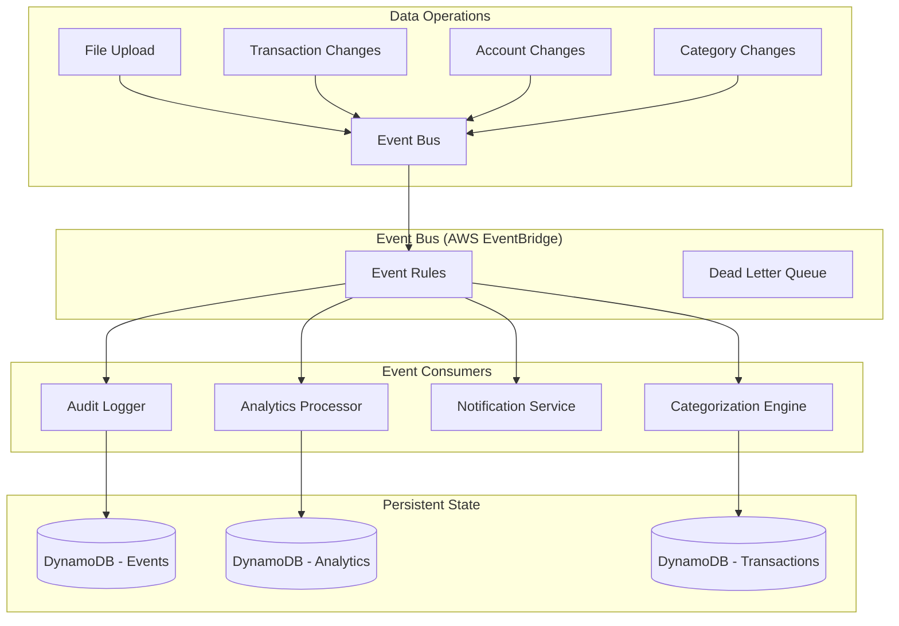

# Event-Driven Architecture Design

## Overview

This document outlines the design for implementing a pub-sub (publish-subscribe) event-driven architecture to handle data state changes in the application. The goal is to decouple operations that need to run when data changes, making the system more maintainable, scalable, and explicit about dependencies between operations.

## Current Implementation Status (Updated)

### ✅ **PHASE 1 COMPLETED**: Event Infrastructure Setup

The core event infrastructure has been **fully implemented** and is ready for use:

#### ✅ Core Infrastructure Complete
1. **Event Models** ✅ - Complete implementation in `backend/src/models/events.py`
   - BaseEvent with full EventBridge format conversion
   - All specific event types: FileProcessedEvent, TransactionsCreatedEvent, TransactionUpdatedEvent, etc.
   - Factory functions for event creation
   
2. **Event Publishing Service** ✅ - Full implementation in `backend/src/services/event_service.py`
   - Singleton EventService with batching support (up to 10 events per batch)
   - Retry logic and comprehensive error handling
   - Health check and monitoring capabilities
   - Mock service fallback for development

3. **EventBridge Infrastructure** ✅ - Complete Terraform setup
   - Custom EventBridge bus: `housef3-dev-events`
   - Event store DynamoDB table with GSIs for auditing
   - Dead letter queues for failed events
   - CloudWatch logging integration

4. **EventBridge Rules** ✅ - Comprehensive event routing configured
   - Analytics events rule (routes to future analytics consumer)
   - Categorization events rule (routes to future categorization consumer) 
   - Audit events rule (captures all events)
   - Notification events rule (for critical events)
   - Monitoring and debug rules

5. **Base Consumer Framework** ✅ - Robust foundation in `backend/src/consumers/base_consumer.py`
   - Event parsing from EventBridge/SQS format
   - Error classification and DLQ routing
   - Idempotency support and metrics collection
   - Abstract base class for all consumers

6. **Event DAO** ✅ - EventBridge interaction layer in `backend/src/utils/event_dao.py`
   - EventBridge publishing with batching
   - Health checks and configuration management
   - Mock implementations for testing

7. **Testing Infrastructure** ✅ - Comprehensive test suite in `backend/tests/test_event_infrastructure.py`
   - Event model creation and serialization tests
   - EventService testing with mocks
   - Consumer framework testing

### ✅ **PHASE 2 COMPLETED**: Event Publishers Integration 

**Current State**: The system now uses **event publishing** with shadow mode support for safe migration.

**What's Implemented**:
1. **File Processing Events** ✅ - File processor publishes consolidated `FileProcessedEvent` with transaction IDs
2. **Transaction Operation Events** ✅ - Transaction handlers publish `TransactionUpdatedEvent` and `TransactionsDeletedEvent`
3. **Account Operation Events** ✅ - Account handlers publish `AccountCreatedEvent`, `AccountUpdatedEvent`, and `AccountDeletedEvent`
4. **Shadow Mode Support** ✅ - Environment flags allow dual operation (events + direct triggers) for validation

**Status**: ✅ **COMPLETED** - File processor now publishes consolidated `FileProcessedEvent` with transaction IDs included.

**Updated Implementation**: In `backend/src/handlers/file_processor.py`:
```python
# NEW: Event publishing (consolidated)
file_event = FileProcessedEvent(
    user_id=user_id,
    file_id=str(transaction_file.file_id),
    account_id=str(transaction_file.account_id),
    transaction_count=file_processor_response.transaction_count,
    duplicate_count=file_processor_response.duplicate_count or 0,
    processing_status='success',
    transaction_ids=transaction_ids  # Consolidated - no separate event needed
)
```

### ✅ **PHASE 3 COMPLETED**: Event Consumers Implementation

**What's Implemented**:
1. **Analytics Consumer** ✅ - Processes events that trigger analytics recomputation by creating AnalyticsProcessingStatus records
2. **Categorization Consumer** ✅ - Applies category rules to new transactions from file uploads  
3. **Audit Consumer** ✅ - Logs all events to event store table for compliance and debugging
4. **Lambda Infrastructure** ✅ - Terraform configuration deploys consumers and connects them to EventBridge rules
5. **Monitoring & Alarms** ✅ - CloudWatch alarms track consumer health and performance
6. **Testing Framework** ✅ - Comprehensive testing guide with validation checklists and monitoring procedures

**Event Flow Implemented**:
- **File Processing**: `file.processed` → Analytics Consumer (priority 2) + Categorization Consumer + Audit Consumer
- **Transaction Updates**: `transaction.updated` → Analytics Consumer (priority 3) + Audit Consumer  
- **Account Changes**: `account.created/updated/deleted` → Analytics Consumer (various priorities) + Audit Consumer
- **All Events**: Every event → Audit Consumer for complete audit trail

### ❌ **PHASE 4 PENDING**: Migration and Integration

**What's Missing**:
1. **Shadow Mode Deployment** - Dual event + direct triggering
2. **Performance Testing** - Event throughput validation
3. **Cutover Process** - Disable direct triggers, enable events only
4. **Monitoring Dashboard** - Event processing metrics

## Current State Analysis

### Current Triggers and Dependencies

Based on the existing codebase, the following operations currently trigger downstream processes using **direct calls**:

1. **Transaction File Upload/Processing**:
   - Triggers: Analytics refresh (medium priority)
   - Current implementation: ✅ Direct call to `trigger_analytics_refresh()` (file_processor.py:203)
   - **Should become**: 🔄 FileProcessedEvent + TransactionsCreatedEvent

2. **Transaction Changes** (edit, delete, bulk operations):
   - Triggers: Analytics refresh (medium priority)
   - Current implementation: ✅ Direct call to `trigger_analytics_for_transaction_change()`
   - **Should become**: 🔄 TransactionUpdatedEvent + TransactionsDeletedEvent

3. **Account Changes** (associate, unassociate, create, update, delete):
   - Triggers: Analytics refresh (priority varies by change type)
   - Current implementation: ✅ Direct call to `trigger_analytics_for_account_change()` (file_operations.py:436)
   - **Should become**: 🔄 AccountCreatedEvent + AccountUpdatedEvent + AccountDeletedEvent

4. **Category Rule Application**:
   - Triggers: Transaction categorization, potential analytics refresh
   - Current implementation: ✅ Direct categorization via `CategoryRuleEngine`
   - **Should become**: 🔄 CategoryRulesAppliedEvent + CategoryRuleCreatedEvent

### Pain Points with Current Approach

1. **Tight Coupling**: Services directly call other services, creating dependencies
2. **Inconsistent Triggering**: Some operations trigger analytics, others don't
3. **Hard to Extend**: Adding new downstream operations requires code changes in multiple places
4. **No Event History**: No record of what events occurred and when
5. **Error Handling**: If downstream operations fail, it can affect the primary operation
6. **Testing Complexity**: Hard to test operations in isolation

## Implementation Roadmap to Complete Event-Driven Architecture

### Phase 2: Event Publishers Integration (Week 1-2)

#### Week 1: File Processing Events Integration

**Modify File Processor Service** to publish events instead of direct triggers:

```python
# backend/src/services/file_processor_service.py
from services.event_service import event_service
from models.events import FileProcessedEvent, TransactionsCreatedEvent

def process_file(transaction_file: TransactionFile) -> FileProcessorResponse:
    """Enhanced with event publishing"""
    logger.info(f"Processing file {transaction_file.file_id}")
    
    try:
        # Existing processing logic...
        response = update_file(old_transaction_file, transaction_file)
        
        # NEW: Publish events instead of direct triggering
        if response.transaction_count > 0:
            # Publish file processed event
            file_event = FileProcessedEvent(
                user_id=transaction_file.user_id,
                file_id=str(transaction_file.file_id),
                account_id=str(transaction_file.account_id),
                transaction_count=response.transaction_count,
                duplicate_count=response.duplicate_count or 0,
                processing_status='success'
            )
            event_service.publish_event(file_event)
            
            # Publish transactions created event
            if response.transactions:
                transaction_ids = [str(tx.transaction_id) for tx in response.transactions]
                tx_event = TransactionsCreatedEvent(
                    user_id=transaction_file.user_id,
                    file_id=str(transaction_file.file_id),
                    account_id=str(transaction_file.account_id),
                    transaction_ids=transaction_ids,
                    transaction_count=len(transaction_ids)
                )
                event_service.publish_event(tx_event)
        
        # REMOVE: Direct analytics triggering
        # trigger_analytics_refresh(user_id, priority=2)  # COMMENTED OUT
        
        return response
        
    except Exception as e:
        logger.error(f"Error processing file: {str(e)}")
        
        # Publish failure event
        file_event = FileProcessedEvent(
            user_id=transaction_file.user_id,
            file_id=str(transaction_file.file_id),
            account_id=str(transaction_file.account_id) if transaction_file.account_id else '',
            transaction_count=0,
            duplicate_count=0,
            processing_status='failed',
            error_message=str(e)
        )
        event_service.publish_event(file_event)
        raise
```

#### Week 2: Transaction and Account Events Integration

**Modify Transaction Operations** to publish events:

```python
# backend/src/handlers/transaction_operations.py
from models.events import TransactionUpdatedEvent, TransactionsDeletedEvent
from services.event_service import event_service

def update_transaction_handler(event: Dict[str, Any], user_id: str) -> Dict[str, Any]:
    """Enhanced with event publishing"""
    try:
        transaction_id = event["pathParameters"]["id"]
        updates = json.loads(event["body"])
        
        # Get existing transaction for comparison
        old_transaction = get_transaction_by_id(transaction_id, user_id)
        if not old_transaction:
            return create_response(404, {"message": "Transaction not found"})
        
        # Apply updates...
        update_transaction(transaction_id, user_id, updates)
        
        # NEW: Track what changed and publish event
        changes = []
        for field, new_value in updates.items():
            old_value = getattr(old_transaction, field, None)
            if old_value != new_value:
                changes.append({
                    'field': field,
                    'oldValue': old_value,
                    'newValue': new_value
                })
        
        if changes:
            update_event = TransactionUpdatedEvent(
                user_id=user_id,
                transaction_id=transaction_id,
                account_id=str(old_transaction.account_id),
                changes=changes
            )
            event_service.publish_event(update_event)
        
        # REMOVE: Direct analytics triggering
        # trigger_analytics_for_transaction_change(user_id, 'edit')  # COMMENTED OUT
        
        return create_response(200, {"message": "Transaction updated successfully"})
        
    except Exception as e:
        logger.error(f"Error updating transaction: {str(e)}")
        return create_response(500, {"message": "Internal server error"})
```

### Phase 3: Event Consumers Implementation (Week 3-4)

#### Week 3: Analytics Consumer

**Create Analytics Event Consumer**:

```python
# backend/src/consumers/analytics_consumer.py
import logging
from typing import Dict, Any
from consumers.base_consumer import BaseEventConsumer
from models.events import BaseEvent
from utils.analytics_utils import trigger_analytics_refresh

logger = logging.getLogger(__name__)

class AnalyticsEventConsumer(BaseEventConsumer):
    """Consumer for events that should trigger analytics processing"""
    
    PRIORITY_MAP = {
        'file.processed': 2,
        'transactions.created': 2,
        'transaction.updated': 3,
        'transactions.deleted': 2,
        'account.created': 3,
        'account.updated': 3,
        'account.deleted': 1
    }
    
    ANALYTICS_TYPE_MAP = {
        'file.processed': ['cash_flow', 'category_trends', 'financial_health'],
        'transactions.created': ['cash_flow', 'category_trends', 'financial_health'],
        'transaction.updated': ['cash_flow'],  # Minimal impact
        'transactions.deleted': ['cash_flow', 'category_trends', 'financial_health'],
        'account.created': [],  # No analytics until transactions exist
        'account.updated': [],  # Metadata only
        'account.deleted': ['cash_flow', 'category_trends', 'financial_health']
    }
    
    def __init__(self):
        super().__init__("analytics_consumer")
    
    def should_process_event(self, event: BaseEvent) -> bool:
        """Only process events that affect analytics"""
        return event.event_type in self.PRIORITY_MAP
    
    def process_event(self, event: BaseEvent) -> None:
        """Trigger analytics processing for the event"""
        try:
            priority = self.PRIORITY_MAP.get(event.event_type, 3)
            analytics_types = self.ANALYTICS_TYPE_MAP.get(event.event_type, [])
            
            logger.info(f"Triggering analytics for {event.event_type} with priority {priority}")
            
            # Use existing analytics triggering system
            success = trigger_analytics_refresh(
                user_id=event.user_id,
                priority=priority,
                analytic_types=analytics_types if analytics_types else None
            )
            
            if not success:
                logger.warning(f"Failed to trigger analytics for event {event.event_id}")
            else:
                logger.info(f"Successfully triggered analytics for event {event.event_id}")
                
        except Exception as e:
            logger.error(f"Error processing analytics event {event.event_id}: {str(e)}")
            raise

def handler(event, context):
    """Lambda handler for analytics events"""
    consumer = AnalyticsEventConsumer()
    return consumer.handle_eventbridge_event(event, context)
```

**Deploy Analytics Consumer Lambda**:

```terraform
# infrastructure/terraform/lambda_consumers.tf
resource "aws_lambda_function" "analytics_consumer" {
  filename         = "../../backend/lambda_deploy.zip"
  function_name    = "${var.project_name}-${var.environment}-analytics-consumer"
  handler          = "consumers/analytics_consumer.handler"
  runtime          = "python3.10"
  role            = aws_iam_role.lambda_exec.arn
  timeout         = 120
  memory_size     = 256
  source_code_hash = base64encode(local.source_code_hash)
  depends_on      = [null_resource.prepare_lambda]

  environment {
    variables = {
      ENVIRONMENT           = var.environment
      ANALYTICS_STATUS_TABLE = aws_dynamodb_table.analytics_status.name
      EVENT_BUS_NAME        = aws_cloudwatch_event_bus.app_events.name
    }
  }

  dead_letter_config {
    target_arn = aws_sqs_queue.event_dlq.arn
  }

  tags = {
    Environment = var.environment
    Project     = var.project_name
    ManagedBy   = "terraform"
  }
}

# Connect EventBridge rule to Lambda
resource "aws_cloudwatch_event_target" "analytics_consumer_target" {
  rule           = aws_cloudwatch_event_rule.analytics_events.name
  event_bus_name = aws_cloudwatch_event_bus.app_events.name
  target_id      = "AnalyticsConsumerTarget"
  arn           = aws_lambda_function.analytics_consumer.arn

  retry_policy {
    maximum_retry_attempts = 3
  }

  dead_letter_config {
    arn = aws_sqs_queue.event_dlq.arn
  }
}

# Permission for EventBridge to invoke Lambda
resource "aws_lambda_permission" "allow_eventbridge_analytics" {
  statement_id  = "AllowExecutionFromEventBridge"
  action        = "lambda:InvokeFunction"
  function_name = aws_lambda_function.analytics_consumer.function_name
  principal     = "events.amazonaws.com"
  source_arn    = aws_cloudwatch_event_rule.analytics_events.arn
}
```

#### Week 4: Categorization and Audit Consumers

**Create remaining consumers** following the same pattern:

1. **Categorization Consumer** - Apply category rules to new transactions
2. **Audit Consumer** - Log all events to the event store
3. **Notification Consumer** - Send notifications for critical events

### Phase 4: Migration and Testing (Week 5)

#### Shadow Mode Implementation

Deploy with **both event publishing AND direct triggering** enabled:

```python
# Configuration flags
ENABLE_EVENT_PUBLISHING = os.environ.get('ENABLE_EVENT_PUBLISHING', 'true').lower() == 'true'
ENABLE_DIRECT_TRIGGERS = os.environ.get('ENABLE_DIRECT_TRIGGERS', 'true').lower() == 'true'

def process_file(transaction_file: TransactionFile) -> FileProcessorResponse:
    """Dual mode: both events and direct triggers"""
    response = update_file(old_transaction_file, transaction_file)
    
    if response.transaction_count > 0:
        # NEW: Event publishing
        if ENABLE_EVENT_PUBLISHING:
            try:
                file_event = FileProcessedEvent(...)
                event_service.publish_event(file_event)
                logger.info("Event published successfully")
            except Exception as e:
                logger.error(f"Event publishing failed: {str(e)}")
        
        # OLD: Direct triggering (kept as backup)
        if ENABLE_DIRECT_TRIGGERS:
            try:
                trigger_analytics_refresh(user_id, priority=2)
                logger.info("Direct trigger successful")
            except Exception as e:
                logger.error(f"Direct trigger failed: {str(e)}")
    
    return response
```

#### Testing and Validation

1. **Monitor both systems** - Verify events and direct triggers produce same results
2. **Performance testing** - Ensure event throughput meets requirements
3. **Error rate monitoring** - Confirm error rates below 1%
4. **Gradual cutover** - Disable direct triggers after validation

## Proposed Event-Driven Architecture

### Architecture Overview



### Core Components

1. **Event Publishers**: Services that publish events when state changes occur
2. **Event Bus**: Central message routing system (AWS EventBridge)
3. **Event Consumers**: Services that subscribe to specific event types
4. **Event Store**: Persistent log of all events for auditing and replay
5. **Dead Letter Queue**: Failed event handling and retry mechanism

## Event Schema Design

### Base Event Structure

```typescript
interface BaseEvent {
  // Event metadata
  eventId: string;           // Unique event identifier
  eventType: string;         // Type of event (see Event Types below)
  eventVersion: string;      // Schema version for backward compatibility
  timestamp: number;         // Unix timestamp in milliseconds
  source: string;           // Which service/component published the event
  
  // Context
  userId: string;           // User who triggered the event
  correlationId?: string;   // For tracking related events
  causationId?: string;     // ID of the event that caused this event
  
  // Event data
  data: Record<string, any>; // Event-specific payload
  metadata?: Record<string, any>; // Additional context
}
```

### Event Types and Schemas

#### 1. File Processing Events

```typescript
// Published when a file is uploaded to S3
interface FileUploadedEvent extends BaseEvent {
  eventType: 'file.uploaded';
  data: {
    fileId: string;
    fileName: string;
    fileSize: number;
    s3Key: string;
    accountId?: string;
    fileFormat?: string;
  };
}

// Published when file processing completes
interface FileProcessedEvent extends BaseEvent {
  eventType: 'file.processed';
  data: {
    fileId: string;
    accountId: string;
    transactionCount: number;
    duplicateCount: number;
    transactionIds: string[];        // NEW: List of created transaction IDs
    dateRange: {
      startDate: string;
      endDate: string;
    };
    processingStatus: 'success' | 'partial' | 'failed';
    errorMessage?: string;
  };
}

// Published when file is associated with an account
interface FileAssociatedEvent extends BaseEvent {
  eventType: 'file.associated';
  data: {
    fileId: string;
    accountId: string;
    previousAccountId?: string;
  };
}
```

#### 2. Transaction Events

```typescript
// Note: TransactionsCreatedEvent has been consolidated into FileProcessedEvent
// FileProcessedEvent now includes transactionIds to reduce verbosity

// Published when a transaction is manually edited
interface TransactionUpdatedEvent extends BaseEvent {
  eventType: 'transaction.updated';
  data: {
    transactionId: string;
    accountId: string;
    changes: {
      field: string;
      oldValue: any;
      newValue: any;
    }[];
  };
}

// Published when transactions are deleted
interface TransactionsDeletedEvent extends BaseEvent {
  eventType: 'transactions.deleted';
  data: {
    transactionIds: string[];
    accountIds: string[];
    deletionType: 'single' | 'bulk' | 'file_reprocessing';
  };
}

// Published when transaction categorization changes
interface TransactionCategorizedEvent extends BaseEvent {
  eventType: 'transaction.categorized';
  data: {
    transactionId: string;
    accountId: string;
    categoryId: string;
    previousCategoryId?: string;
    confidence: number;
    assignmentType: 'manual' | 'rule_based' | 'suggested';
    ruleId?: string;
  };
}
```

#### 3. Account Events

```typescript
// Published when account is created
interface AccountCreatedEvent extends BaseEvent {
  eventType: 'account.created';
  data: {
    accountId: string;
    accountName: string;
    accountType: string;
    currency: string;
  };
}

// Published when account is updated
interface AccountUpdatedEvent extends BaseEvent {
  eventType: 'account.updated';
  data: {
    accountId: string;
    changes: {
      field: string;
      oldValue: any;
      newValue: any;
    }[];
  };
}

// Published when account is deleted
interface AccountDeletedEvent extends BaseEvent {
  eventType: 'account.deleted';
  data: {
    accountId: string;
    transactionCount: number; // How many transactions were affected
  };
}
```

#### 4. Category Events

```typescript
// Published when category rules are applied to transactions
interface CategoryRulesAppliedEvent extends BaseEvent {
  eventType: 'category.rules_applied';
  data: {
    categoryId: string;
    ruleIds: string[];
    transactionIds: string[];
    applicationType: 'manual' | 'bulk' | 'automated';
  };
}

// Published when a new category rule is created
interface CategoryRuleCreatedEvent extends BaseEvent {
  eventType: 'category.rule_created';
  data: {
    categoryId: string;
    ruleId: string;
    rulePattern: string;
    autoApply: boolean;
  };
}
```

## Event Consumer Design

### 1. Analytics Processor Consumer

Consumes events that should trigger analytics recomputation.

```typescript
interface AnalyticsConsumerConfig {
  eventTypes: [
    'file.processed',
    'transactions.created',
    'transaction.updated',
    'transactions.deleted',
    'account.created',
    'account.updated',
    'account.deleted'
  ];
  priority: {
    'file.processed': 2,        // Medium priority
    'transactions.created': 2,  // Medium priority
    'transaction.updated': 3,   // Low priority (single transaction)
    'transactions.deleted': 2,  // Medium priority
    'account.created': 3,       // Low priority (no transactions yet)
    'account.updated': 3,       // Low priority (metadata only)
    'account.deleted': 1        // High priority (major data change)
  };
}
```

Handler logic:
1. Receive event
2. Determine affected analytics types based on event
3. Create/update `AnalyticsProcessingStatus` records
4. Let existing analytics processor pick up the work

### 2. Categorization Engine Consumer

Applies category rules when new transactions are created.

```typescript
interface CategorizationConsumerConfig {
  eventTypes: [
    'transactions.created',
    'category.rule_created'
  ];
  batchSize: 100; // Process transactions in batches
}
```

Handler logic:
1. Receive `transactions.created` event
2. Get user's active category rules
3. Apply rules to new transactions
4. Publish `transaction.categorized` events for matches

### 3. Notification Service Consumer

Sends notifications for important events.

```typescript
interface NotificationConsumerConfig {
  eventTypes: [
    'file.processed',
    'transactions.deleted',
    'account.deleted'
  ];
}
```

### 4. Audit Logger Consumer

Logs all events for compliance and debugging.

```typescript
interface AuditConsumerConfig {
  eventTypes: ['*']; // Subscribe to all events
  storage: 'dynamodb'; // Store in audit table
}
```

## Next Steps for Implementation

### Immediate Actions (This Week)

1. **Create Analytics Consumer** - Implement `backend/src/consumers/analytics_consumer.py`
2. **Create Lambda Target** - Add Terraform configuration to connect EventBridge rule to Lambda
3. **Integrate File Processing Events** - Modify file processor to publish events
4. **Deploy in Shadow Mode** - Enable both events and direct triggers

### Short Term (Next 2 Weeks)

1. **Complete All Consumers** - Categorization, audit, and notification consumers
2. **Integration Testing** - Verify event flow works end-to-end
3. **Performance Validation** - Ensure event throughput meets requirements
4. **Cutover Process** - Disable direct triggers, monitor for issues

### Success Criteria

1. **Zero data loss** during migration
2. **Analytics triggering** works identically to before
3. **Event throughput** handles peak loads (100+ events/min)
4. **Error rate** below 1% for event processing
5. **Latency** for event processing under 30 seconds
6. **Complete audit trail** of all data changes

## Benefits of This Approach

### 1. Decoupling
- Services don't need to know about downstream dependencies
- Easy to add new consumers without changing publishers
- Can disable/enable consumers independently

### 2. Reliability
- Events are persisted before processing
- Automatic retry with exponential backoff
- Dead letter queues for failed events
- No lost events if consumers are temporarily down

### 3. Scalability
- Consumers can scale independently based on load
- Batch processing for efficiency
- Can add multiple instances of consumers

### 4. Observability
- Complete audit trail of all events
- Easy to debug by following event chain
- Metrics on event processing times and failure rates

### 5. Testability
- Can test publishers and consumers separately
- Easy to replay events for testing
- Can verify expected events are published

### 6. Flexibility
- Easy to change event routing without code changes
- Can add new event types without breaking existing consumers
- Support for event versioning and schema evolution

## Conclusion

The event infrastructure foundation is **complete and ready for use**. The remaining work focuses on:

1. **Publisher Integration** - Modify existing services to publish events instead of direct calls
2. **Consumer Implementation** - Create Lambda functions to process events
3. **Migration Process** - Safely transition from direct calls to event-driven architecture

This approach provides a robust, scalable, and maintainable foundation for handling data state changes with complete audit trails and loose coupling between services. 