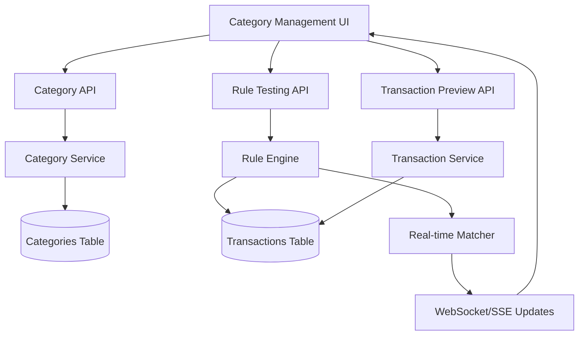

# Category Management Design Document

## 1. Overview

This document outlines the design for a comprehensive category management system that allows users to:
- Create and manage transaction categories
- Define matching rules using regex or simplified "find" patterns  
- Review and preview matching transactions in real-time
- Automatically categorize transactions based on defined rules

## 2. Current State Analysis

### 2.1 Existing Infrastructure
- ✅ Category model with basic CRUD operations (`backend/src/models/category.py`)
- ✅ DynamoDB table for categories with proper indexes (`infrastructure/terraform/dynamo_categories.tf`)
- ✅ Category API handlers (`backend/src/handlers/category_operations.py`)
- ✅ Basic frontend category filtering (`frontend/src/new-ui/components/TransactionFilters.tsx`)
- ✅ Placeholder category management tab (`frontend/src/new-ui/views/CategoryManagementTab.tsx`)

### 2.2 Current Gaps
- ❌ No transaction-category assignment system (transactions are not currently categorized)
- ❌ No real-time rule testing/preview functionality
- ❌ No automatic categorization engine
- ❌ Limited rule matching capabilities (basic structure exists but not functional)
- ❌ No bulk categorization operations
- ❌ No support for multiple category matches per transaction
- ❌ No hierarchical category functionality (parent-child relationships)
- ❌ No suggestion review and confirmation workflow for category assignments

**Important Note**: Currently, **no transactions have category assignments** in the database, so this implementation will be **adding new functionality** rather than migrating existing data.

## 3. System Architecture

### 3.1 Components Overview



### 3.2 Data Flow for Real-time Matching

1. User types regex/pattern in UI
2. Frontend sends pattern to Rule Testing API
3. Rule Engine queries transactions and applies pattern
4. Matching results streamed back to UI via WebSocket/SSE
5. UI updates preview in real-time

## 4. Backend Implementation

### 4.1 Enhanced Transaction Model

Update `backend/src/models/transaction.py` to support multiple categories:

```python
# Transaction Category Assignment Model
class TransactionCategoryAssignment(BaseModel):
    category_id: uuid.UUID = Field(alias="categoryId")
    confidence: float = Field(default=1.0)  # 0.0 to 1.0 confidence score
    status: str = Field(default="suggested")  # "suggested" or "confirmed"
    is_manual: bool = Field(default=False, alias="isManual")  # Manually assigned vs auto-assigned
    assigned_at: int = Field(default_factory=lambda: int(datetime.now(timezone.utc).timestamp() * 1000), alias="assignedAt")
    confirmed_at: Optional[int] = Field(default=None, alias="confirmedAt")  # When user confirmed this assignment
    rule_id: Optional[str] = Field(default=None, alias="ruleId")  # Which rule triggered this assignment

# Add to Transaction model
categories: List[TransactionCategoryAssignment] = Field(default_factory=list)
primary_category_id: Optional[uuid.UUID] = Field(default=None, alias="primaryCategoryId")  # Main category for display

# Computed properties for backward compatibility
@property
def category_id(self) -> Optional[uuid.UUID]:
    """Returns the primary category ID for backward compatibility"""
    return self.primary_category_id

@property
def manual_category(self) -> bool:
    """Returns True if primary category was manually assigned"""
    if self.primary_category_id:
        primary_assignment = next(
            (cat for cat in self.categories if cat.category_id == self.primary_category_id), 
            None
        )
        return primary_assignment.is_manual if primary_assignment else False
    return False
```

### 4.2 Enhanced Category Rule Model

Extend the existing `CategoryRule` in `backend/src/models/category.py`:

```python
class MatchCondition(str, Enum):
    CONTAINS = "contains"
    STARTS_WITH = "starts_with" 
    ENDS_WITH = "ends_with"
    EQUALS = "equals"
    REGEX = "regex"
    AMOUNT_GREATER = "amount_greater"
    AMOUNT_LESS = "amount_less"
    AMOUNT_BETWEEN = "amount_between"

class CategoryRule(BaseModel):
    rule_id: str = Field(default_factory=lambda: f"rule_{uuid4().hex[:8]}", alias="ruleId")
    field_to_match: str = Field(alias="fieldToMatch")  # description, payee, memo, amount
    condition: MatchCondition
    value: str  # The pattern/value to match
    case_sensitive: bool = Field(default=False, alias="caseSensitive")
    priority: int = Field(default=0)  # Higher priority rules checked first
    enabled: bool = Field(default=True)
    confidence: float = Field(default=1.0)  # How confident we are in this rule (0.0-1.0)
    
    # For amount-based rules
    amount_min: Optional[Decimal] = Field(default=None, alias="amountMin")
    amount_max: Optional[Decimal] = Field(default=None, alias="amountMax")
    
    # Suggestion behavior
    allow_multiple_matches: bool = Field(default=True, alias="allowMultipleMatches")
    auto_suggest: bool = Field(default=True, alias="autoSuggest")  # If false, rule won't create automatic suggestions
```

### 4.3 Hierarchical Category Support

Enhance the `Category` model to better support parent-child relationships:

```python
class Category(BaseModel):
    # ... existing fields ...
    
    # Enhanced hierarchical support
    parent_category_id: Optional[UUID] = Field(default=None, alias="parentCategoryId")
    inherit_parent_rules: bool = Field(default=True, alias="inheritParentRules")
    rule_inheritance_mode: str = Field(default="additive", alias="ruleInheritanceMode")  # "additive", "override", "disabled"
    
    # Computed properties for hierarchy navigation
    @property
    def is_root_category(self) -> bool:
        return self.parent_category_id is None
    
    @property
    def category_path(self) -> str:
        """Returns full category path like 'Expenses > Food > Restaurants'"""
        # Implementation would traverse up the parent chain
        pass

class CategoryHierarchy(BaseModel):
    """Helper model for managing category hierarchies"""
    category: Category
    children: List['CategoryHierarchy'] = Field(default_factory=list)
    depth: int = Field(default=0)
    full_path: str
    inherited_rules: List[CategoryRule] = Field(default_factory=list)
```

### 4.4 Enhanced Rule Engine Service

Create `backend/src/services/category_rule_engine.py`:

```python
class CategoryRuleEngine:
    def __init__(self):
        self.compiled_patterns = {}  # Cache compiled regex patterns
        self.category_hierarchies = {}  # Cache category hierarchies
    
    def test_rule_against_transactions(
        self, 
        user_id: str, 
        rule: CategoryRule, 
        limit: int = 100
    ) -> List[Transaction]:
        """Test a rule against transactions and return matches"""
        
    def preview_category_matches(
        self, 
        user_id: str, 
        category_id: str,
        include_inherited: bool = True
    ) -> Dict[str, Any]:
        """Preview all transactions that would match a category's rules"""
        
    def apply_category_rules(
        self, 
        user_id: str, 
        transaction_ids: Optional[List[str]] = None,
        create_suggestions: bool = True
    ) -> Dict[str, int]:
        """Apply all category rules to transactions and create suggestions for review"""
        
    def categorize_transaction(
        self,
        transaction: Transaction,
        user_categories: List[Category]
    ) -> List[TransactionCategoryAssignment]:
        """Categorize a single transaction, returning all matching categories as suggestions"""
        
    def create_category_suggestions(
        self,
        transaction: Transaction,
        potential_matches: List[Tuple[Category, CategoryRule, float]]
    ) -> List[TransactionCategoryAssignment]:
        """Create category suggestions when multiple categories match a transaction"""
        
    def get_effective_rules(
        self,
        category: Category,
        all_categories: List[Category]
    ) -> List[CategoryRule]:
        """Get all effective rules for a category including inherited ones"""
        
    def build_category_hierarchy(
        self,
        categories: List[Category]
    ) -> Dict[str, CategoryHierarchy]:
        """Build hierarchical structure from flat category list"""
        
    def generate_regex_from_pattern(
        self, 
        descriptions: List[str]
    ) -> str:
        """Generate regex pattern from sample transaction descriptions"""

class CategorySuggestionStrategy(str, Enum):
    ALL_MATCHES = "all_matches"  # Show all matching categories as suggestions
    TOP_N_MATCHES = "top_n_matches"  # Show only top N highest confidence matches
    CONFIDENCE_THRESHOLD = "confidence_threshold"  # Show only matches above threshold
    PRIORITY_FILTERED = "priority_filtered"  # Show matches filtered by rule priority
```

### 4.5 Multiple Category Matching & Suggestion Creation

The system creates category suggestions when multiple categories match a single transaction:

```python
class CategoryMatcher:
    """Handles multiple category matching and suggestion creation"""
    
    def __init__(self, suggestion_strategy: CategorySuggestionStrategy = CategorySuggestionStrategy.ALL_MATCHES):
        self.suggestion_strategy = suggestion_strategy
    
    def find_matching_categories(
        self,
        transaction: Transaction,
        categories: List[Category]
    ) -> List[Tuple[Category, CategoryRule, float]]:
        """Find all categories that match a transaction"""
        matches = []
        
        for category in categories:
            effective_rules = self.get_effective_rules(category, categories)
            for rule in effective_rules:
                if self.rule_matches_transaction(rule, transaction):
                    confidence = self.calculate_rule_confidence(rule, transaction)
                    matches.append((category, rule, confidence))
                    
                    if rule.stops_processing:
                        break
        
        return matches
    
    def create_suggestions(
        self,
        matches: List[Tuple[Category, CategoryRule, float]]
    ) -> List[TransactionCategoryAssignment]:
        """Create category suggestions based on strategy"""
        
        if self.suggestion_strategy == CategorySuggestionStrategy.ALL_MATCHES:
            return self._create_suggestions_from_all_matches(matches)
        
        elif self.suggestion_strategy == CategorySuggestionStrategy.TOP_N_MATCHES:
            return self._create_top_n_suggestions(matches)
        
        elif self.suggestion_strategy == CategorySuggestionStrategy.CONFIDENCE_THRESHOLD:
            return self._create_threshold_suggestions(matches)
        
        else:  # PRIORITY_FILTERED
            return self._create_priority_filtered_suggestions(matches)
    
    def _resolve_by_specificity(self, matches):
        """Prefer child categories over parent categories"""
        # Sort by category depth (deeper = more specific)
        # Implementation would calculate category depth in hierarchy
        pass
```

### 4.6 Real-time Rule Testing API

Create `backend/src/handlers/category_rule_testing.py`:

```python
# WebSocket handler for real-time rule testing
def rule_test_handler(event, context):
    """
    WebSocket endpoint for real-time rule testing
    POST /api/categories/test-rule
    """
    
def preview_matches_handler(event, context):
    """
    GET /api/categories/{categoryId}/preview-matches
    """
    
def generate_regex_handler(event, context):
    """
    POST /api/categories/generate-regex
    Body: { "descriptions": ["AMAZON.COM", "AMAZON PRIME"] }
    Response: { "regex": "AMAZON", "confidence": 0.95 }
    """
```

### 4.7 Enhanced Category Operations

Extend `backend/src/handlers/category_operations.py`:

```python
def apply_category_rules_handler(event, context):
    """
    POST /api/categories/{categoryId}/apply-rules
    Apply category rules to existing transactions and create suggestions
    Body: { "createSuggestions": true, "strategy": "all_matches" }
    """
    
def bulk_categorize_handler(event, context):
    """
    POST /api/transactions/bulk-categorize
    Body: { "transactionIds": [...], "categoryId": "...", "replaceExisting": false }
    """

def get_category_hierarchy_handler(event, context):
    """
    GET /api/categories/hierarchy
    Returns hierarchical category structure
    """

def get_transaction_category_suggestions_handler(event, context):
    """
    GET /api/transactions/{transactionId}/category-suggestions
    Returns category suggestions awaiting user review
    """

def confirm_category_suggestions_handler(event, context):
    """
    POST /api/transactions/{transactionId}/confirm-suggestions
    Body: { "confirmedCategoryIds": [...], "primaryCategoryId": "..." }
    """

def remove_transaction_category_handler(event, context):
    """
    DELETE /api/transactions/{transactionId}/categories/{categoryId}
    Remove a specific category assignment from a transaction
    """
```

## 5. Frontend Implementation

### 5.1 Enhanced Category Management Tab with Hierarchy Support

Replace the placeholder `frontend/src/new-ui/views/CategoryManagementTab.tsx`:

```typescript
interface CategoryManagementTabProps {}

const CategoryManagementTab: React.FC<CategoryManagementTabProps> = () => {
  const [selectedCategory, setSelectedCategory] = useState<Category | null>(null);
  const [ruleTestResults, setRuleTestResults] = useState<Transaction[]>([]);
  const [isTestingRule, setIsTestingRule] = useState(false);
  const [categoryHierarchy, setCategoryHierarchy] = useState<CategoryHierarchy[]>([]);
  const [suggestionStrategy, setSuggestionStrategy] = useState<CategorySuggestionStrategy>('all_matches');
  const [showSuggestions, setShowSuggestions] = useState(false);

  const loadCategoryHierarchy = async () => {
    try {
      const hierarchy = await CategoryService.getCategoryHierarchy();
      setCategoryHierarchy(hierarchy);
    } catch (error) {
      console.error('Error loading category hierarchy:', error);
    }
  };

  useEffect(() => {
    loadCategoryHierarchy();
  }, []);

  return (
    <div className="category-management-container">
      <div className="category-management-header">
        <div className="category-management-controls">
          <SuggestionStrategySelector 
            strategy={suggestionStrategy}
            onStrategyChange={setSuggestionStrategy}
          />
          <button 
            className={`suggestion-toggle ${showSuggestions ? 'active' : ''}`}
            onClick={() => setShowSuggestions(!showSuggestions)}
          >
            {showSuggestions ? 'Hide' : 'Show'} Suggestions
          </button>
        </div>
      </div>
      
      <div className="category-main-content">
        <div className="category-list-section">
          <CategoryHierarchyTree 
            hierarchy={categoryHierarchy}
            selectedCategory={selectedCategory}
            onSelectCategory={setSelectedCategory}
            showSuggestions={showSuggestions}
          />
        </div>
        
        <div className="category-details-section">
          {selectedCategory ? (
            <CategoryEditor 
              category={selectedCategory}
              hierarchy={categoryHierarchy}
              onRuleTest={handleRuleTest}
              testResults={ruleTestResults}
              isTestingRule={isTestingRule}
              suggestionStrategy={suggestionStrategy}
            />
          ) : (
            <EmptyStateMessage />
          )}
        </div>
      </div>
    </div>
  );
};
```

### 5.2 Hierarchical Category Tree Component

Create `frontend/src/new-ui/components/CategoryHierarchyTree.tsx`:

```typescript
interface CategoryHierarchyTreeProps {
  hierarchy: CategoryHierarchy[];
  selectedCategory: Category | null;
  onSelectCategory: (category: Category) => void;
  showSuggestions: boolean;
}

const CategoryHierarchyTree: React.FC<CategoryHierarchyTreeProps> = ({
  hierarchy,
  selectedCategory,
  onSelectCategory,
  showSuggestions
}) => {
  const [expandedNodes, setExpandedNodes] = useState<Set<string>>(new Set());

  const toggleNodeExpansion = (categoryId: string) => {
    const newExpanded = new Set(expandedNodes);
    if (newExpanded.has(categoryId)) {
      newExpanded.delete(categoryId);
    } else {
      newExpanded.add(categoryId);
    }
    setExpandedNodes(newExpanded);
  };

  const renderCategoryNode = (node: CategoryHierarchy, depth: number = 0) => {
    const isExpanded = expandedNodes.has(node.category.categoryId);
    const hasChildren = node.children.length > 0;
    const isSelected = selectedCategory?.categoryId === node.category.categoryId;

    return (
      <div key={node.category.categoryId} className="category-tree-node">
        <div 
          className={`category-node-content depth-${depth} ${isSelected ? 'selected' : ''}`}
          onClick={() => onSelectCategory(node.category)}
        >
          <div className="category-node-header">
            {hasChildren && (
              <button
                className={`expand-toggle ${isExpanded ? 'expanded' : ''}`}
                onClick={(e) => {
                  e.stopPropagation();
                  toggleNodeExpansion(node.category.categoryId);
                }}
              >
                ▶
              </button>
            )}
            
            <span className="category-icon">
              {node.category.icon || '📁'}
            </span>
            
            <span className="category-name">
              {node.category.name}
            </span>
            
            <span className="category-stats">
              ({node.category.rules.length + node.inherited_rules.length} rules)
            </span>
            
            {showSuggestions && node.category.hasSuggestions && (
              <span className="suggestion-indicator" title="Has unconfirmed suggestions">
                📋
              </span>
            )}
          </div>
          
          <div className="category-path">
            {node.full_path}
          </div>
        </div>
        
        {hasChildren && isExpanded && (
          <div className="category-children">
            {node.children.map(child => renderCategoryNode(child, depth + 1))}
          </div>
        )}
      </div>
    );
  };

  return (
    <div className="category-hierarchy-tree">
      <div className="tree-header">
        <h3>Categories</h3>
        <button className="add-category-btn">+ Add Category</button>
      </div>
      
      <div className="tree-content">
        {hierarchy.map(node => renderCategoryNode(node))}
      </div>
    </div>
  );
};
```

### 5.3 Multiple Category Display Component

Create `frontend/src/new-ui/components/MultipleCategoryDisplay.tsx`:

```typescript
interface MultipleCategoryDisplayProps {
  categories: TransactionCategoryAssignment[];
  availableCategories: Category[];
  onAddCategory: (categoryId: string) => void;
  onRemoveCategory: (categoryId: string) => void;
  onSetPrimary: (categoryId: string) => void;
  primaryCategoryId?: string;
  isEditable: boolean;
}

const MultipleCategoryDisplay: React.FC<MultipleCategoryDisplayProps> = ({
  categories,
  availableCategories,
  onAddCategory,
  onRemoveCategory,
  onSetPrimary,
  primaryCategoryId,
  isEditable
}) => {
  const [showAddCategory, setShowAddCategory] = useState(false);

  const getCategoryName = (categoryId: string) => {
    const category = availableCategories.find(c => c.categoryId === categoryId);
    return category?.name || 'Unknown Category';
  };

  const getConfidenceColor = (confidence: number) => {
    if (confidence >= 0.8) return 'high-confidence';
    if (confidence >= 0.6) return 'medium-confidence';
    return 'low-confidence';
  };

  return (
    <div className="multiple-category-display">
      <div className="category-assignments">
        {categories.map((assignment) => (
          <div 
            key={assignment.category_id}
            className={`category-assignment ${assignment.category_id === primaryCategoryId ? 'primary' : ''}`}
          >
            <div className="category-info">
              <span className="category-name">
                {getCategoryName(assignment.category_id)}
              </span>
              
              <div className="assignment-details">
                <span className={`confidence-badge ${getConfidenceColor(assignment.confidence)}`}>
                  {Math.round(assignment.confidence * 100)}%
                </span>
                
                {assignment.is_manual && (
                  <span className="manual-badge" title="Manually assigned">
                    Manual
                  </span>
                )}
                
                {assignment.rule_id && (
                  <span className="rule-badge" title={`Assigned by rule: ${assignment.rule_id}`}>
                    Auto
                  </span>
                )}
              </div>
            </div>
            
            {isEditable && (
              <div className="category-actions">
                {assignment.category_id !== primaryCategoryId && (
                  <button
                    className="set-primary-btn"
                    onClick={() => onSetPrimary(assignment.category_id)}
                    title="Set as primary category"
                  >
                    ⭐
                  </button>
                )}
                
                <button
                  className="remove-category-btn"
                  onClick={() => onRemoveCategory(assignment.category_id)}
                  title="Remove category"
                >
                  ✕
                </button>
              </div>
            )}
          </div>
        ))}
      </div>
      
      {isEditable && (
        <div className="add-category-section">
          {showAddCategory ? (
            <CategorySelector
              availableCategories={availableCategories.filter(
                cat => !categories.some(assignment => assignment.category_id === cat.categoryId)
              )}
              onSelect={(categoryId) => {
                onAddCategory(categoryId);
                setShowAddCategory(false);
              }}
              onCancel={() => setShowAddCategory(false)}
            />
          ) : (
            <button
              className="add-category-trigger"
              onClick={() => setShowAddCategory(true)}
            >
              + Add Category
            </button>
          )}
        </div>
      )}
    </div>
  );
};
```

### 5.4 Category Suggestion Review Component

Create `frontend/src/new-ui/components/CategorySuggestionReviewModal.tsx`:

```typescript
interface CategorySuggestionReviewModalProps {
  transaction: Transaction;
  categorySuggestions: TransactionCategoryAssignment[];
  onConfirmSuggestions: (confirmedCategoryIds: string[], primaryCategoryId: string) => void;
  onCancel: () => void;
  isOpen: boolean;
}

const CategorySuggestionReviewModal: React.FC<CategorySuggestionReviewModalProps> = ({
  transaction,
  categorySuggestions,
  onConfirmSuggestions,
  onCancel,
  isOpen
}) => {
  const [confirmedCategories, setConfirmedCategories] = useState<Set<string>>(new Set());
  const [primaryCategory, setPrimaryCategory] = useState<string>('');

  useEffect(() => {
    if (isOpen && categorySuggestions.length > 0) {
      // Auto-select the highest confidence suggestion as primary
      const highest = categorySuggestions.reduce((max, current) => 
        current.confidence > max.confidence ? current : max
      );
      setPrimaryCategory(highest.category_id);
      setConfirmedCategories(new Set([highest.category_id]));
    }
  }, [isOpen, categorySuggestions]);

  const handleCategoryToggle = (categoryId: string) => {
    const newConfirmed = new Set(confirmedCategories);
    if (newConfirmed.has(categoryId)) {
      newConfirmed.delete(categoryId);
      if (primaryCategory === categoryId) {
        setPrimaryCategory(newConfirmed.size > 0 ? newConfirmed.values().next().value : '');
      }
    } else {
      newConfirmed.add(categoryId);
      if (!primaryCategory) {
        setPrimaryCategory(categoryId);
      }
    }
    setConfirmedCategories(newConfirmed);
  };

  const handleConfirmSuggestions = () => {
    if (confirmedCategories.size > 0 && primaryCategory) {
      onConfirmSuggestions(Array.from(confirmedCategories), primaryCategory);
    }
  };

  if (!isOpen) return null;

  return (
    <div className="category-suggestion-modal-overlay">
      <div className="category-suggestion-modal">
        <div className="modal-header">
          <h3>Review Category Suggestions</h3>
          <button className="close-btn" onClick={onCancel}>✕</button>
        </div>
        
        <div className="modal-content">
          <div className="transaction-summary">
            <h4>Transaction Details</h4>
            <div className="transaction-info">
              <span><strong>Date:</strong> {new Date(transaction.date).toLocaleDateString()}</span>
              <span><strong>Description:</strong> {transaction.description}</span>
              <span><strong>Amount:</strong> {transaction.amount}</span>
            </div>
          </div>
          
          <div className="suggestion-options">
            <h4>Suggested categories for this transaction:</h4>
            <p className="instruction-text">Select which categories to confirm. You can confirm multiple categories.</p>
            
            {categorySuggestions.map((suggestion) => {
              const categoryName = availableCategories.find(c => c.categoryId === suggestion.category_id)?.name || 'Unknown';
              const matchingRule = suggestion.rule_id ? rules.find(r => r.rule_id === suggestion.rule_id) : null;
              
              return (
                <div key={suggestion.category_id} className="suggestion-option">
                  <label className="category-option">
                    <input
                      type="checkbox"
                      checked={confirmedCategories.has(suggestion.category_id)}
                      onChange={() => handleCategoryToggle(suggestion.category_id)}
                    />
                    
                    <div className="category-details">
                      <span className="category-name">{categoryName}</span>
                      <span className="confidence">Confidence: {Math.round(suggestion.confidence * 100)}%</span>
                      <span className="suggestion-status">Status: Suggested</span>
                      {matchingRule && (
                        <span className="matching-rule">
                          Rule: {matchingRule.field_to_match} {matchingRule.condition} "{matchingRule.value}"
                        </span>
                      )}
                    </div>
                    
                    {confirmedCategories.has(suggestion.category_id) && (
                      <label className="primary-radio">
                        <input
                          type="radio"
                          name="primaryCategory"
                          checked={primaryCategory === suggestion.category_id}
                          onChange={() => setPrimaryCategory(suggestion.category_id)}
                        />
                        Primary
                      </label>
                    )}
                  </label>
                </div>
              );
            })}
          </div>
        </div>
        
        <div className="modal-actions">
          <button className="cancel-btn" onClick={onCancel}>
            Cancel
          </button>
          <button 
            className="confirm-btn" 
            onClick={handleConfirmSuggestions}
            disabled={confirmedCategories.size === 0 || !primaryCategory}
          >
            Confirm Selected Categories
          </button>
        </div>
      </div>
    </div>
  );
};
```

### 5.5 Real-time Rule Testing Component

Create `frontend/src/new-ui/components/RuleTestingPanel.tsx`:

```typescript
interface RuleTestingPanelProps {
  rule: CategoryRule;
  onRuleChange: (rule: CategoryRule) => void;
  category: Category;
}

const RuleTestingPanel: React.FC<RuleTestingPanelProps> = ({ 
  rule, 
  onRuleChange, 
  category 
}) => {
  const [matchingTransactions, setMatchingTransactions] = useState<Transaction[]>([]);
  const [isLivePreview, setIsLivePreview] = useState(false);
  const debouncedRule = useDebounce(rule, 500); // Debounce API calls

  // Real-time testing hook
  useEffect(() => {
    if (isLivePreview && debouncedRule.value) {
      testRuleRealTime(debouncedRule);
    }
  }, [debouncedRule, isLivePreview]);

  const testRuleRealTime = async (rule: CategoryRule) => {
    try {
      const results = await CategoryService.testRule(rule);
      setMatchingTransactions(results.transactions);
    } catch (error) {
      console.error('Error testing rule:', error);
    }
  };

  return (
    <div className="rule-testing-panel">
      <div className="rule-editor">
        <RuleEditor rule={rule} onChange={onRuleChange} />
        
        <div className="testing-controls">
          <label>
            <input 
              type="checkbox" 
              checked={isLivePreview}
              onChange={(e) => setIsLivePreview(e.target.checked)}
            />
            Live Preview
          </label>
          <button onClick={() => testRuleRealTime(rule)}>
            Test Rule
          </button>
        </div>
      </div>
      
      <div className="preview-results">
        <h4>Matching Transactions ({matchingTransactions.length})</h4>
        <TransactionPreviewList 
          transactions={matchingTransactions}
          highlightField={rule.fieldToMatch}
          highlightPattern={rule.value}
        />
      </div>
    </div>
  );
};
```

### 5.6 Smart Pattern Builder

Create `frontend/src/new-ui/components/SmartPatternBuilder.tsx`:

```typescript
interface SmartPatternBuilderProps {
  onPatternGenerated: (pattern: string, regex: string) => void;
}

const SmartPatternBuilder: React.FC<SmartPatternBuilderProps> = ({ 
  onPatternGenerated 
}) => {
  const [sampleText, setSampleText] = useState('');
  const [generatedPattern, setGeneratedPattern] = useState('');
  const [patternType, setPatternType] = useState<'simple' | 'regex'>('simple');

  const generatePattern = async () => {
    const descriptions = sampleText.split('\n').filter(line => line.trim());
    
    if (patternType === 'simple') {
      // Generate simple "contains" pattern
      const commonWords = findCommonWords(descriptions);
      onPatternGenerated(commonWords[0] || '', `.*${commonWords[0]}.*`);
    } else {
      // Use AI/ML to generate regex
      const response = await CategoryService.generateRegex(descriptions);
      onPatternGenerated(response.pattern, response.regex);
    }
  };

  return (
    <div className="smart-pattern-builder">
      <h4>Smart Pattern Builder</h4>
      <p>Paste sample transaction descriptions to auto-generate patterns:</p>
      
      <textarea
        value={sampleText}
        onChange={(e) => setSampleText(e.target.value)}
        placeholder="AMAZON.COM PURCHASE&#10;AMAZON PRIME MEMBERSHIP&#10;AMAZON MARKETPLACE"
        rows={5}
      />
      
      <div className="pattern-type-selector">
        <label>
          <input 
            type="radio" 
            value="simple"
            checked={patternType === 'simple'}
            onChange={(e) => setPatternType('simple')}
          />
          Simple Pattern (contains)
        </label>
        <label>
          <input 
            type="radio" 
            value="regex"
            checked={patternType === 'regex'}
            onChange={(e) => setPatternType('regex')}
          />
          Advanced Regex
        </label>
      </div>
      
      <button onClick={generatePattern}>Generate Pattern</button>
      
      {generatedPattern && (
        <div className="generated-pattern">
          <strong>Generated Pattern:</strong> {generatedPattern}
        </div>
      )}
    </div>
  );
};
```

### 5.7 Enhanced Category Service

Extend `frontend/src/services/CategoryService.ts`:

```typescript
export class CategoryService {
  static async testRule(rule: CategoryRule): Promise<{ transactions: Transaction[] }> {
    const response = await authenticatedRequest('/api/categories/test-rule', {
      method: 'POST',
      body: JSON.stringify(rule)
    });
    return response;
  }

  static async previewCategoryMatches(categoryId: string): Promise<{ transactions: Transaction[] }> {
    const response = await authenticatedRequest(`/api/categories/${categoryId}/preview-matches`);
    return response;
  }

  static async generateRegex(descriptions: string[]): Promise<{ pattern: string; regex: string; confidence: number }> {
    const response = await authenticatedRequest('/api/categories/generate-regex', {
      method: 'POST',
      body: JSON.stringify({ descriptions })
    });
    return response;
  }

  static async applyCategoryRules(categoryId: string): Promise<{ applied: number }> {
    const response = await authenticatedRequest(`/api/categories/${categoryId}/apply-rules`, {
      method: 'POST'
    });
    return response;
  }

  static async bulkCategorizeTransactions(transactionIds: string[], categoryId: string, replaceExisting: boolean = false): Promise<{ updated: number }> {
    const response = await authenticatedRequest('/api/transactions/bulk-categorize', {
      method: 'POST',
      body: JSON.stringify({ transactionIds, categoryId, replaceExisting })
    });
    return response;
  }

  // Hierarchical category methods
  static async getCategoryHierarchy(): Promise<CategoryHierarchy[]> {
    const response = await authenticatedRequest('/api/categories/hierarchy');
    return response;
  }

  static async createSubCategory(parentCategoryId: string, categoryData: CategoryCreate): Promise<Category> {
    const response = await authenticatedRequest('/api/categories', {
      method: 'POST',
      body: JSON.stringify({ ...categoryData, parentCategoryId })
    });
    return response;
  }

  // Multiple category assignment methods
  static async addCategoryToTransaction(transactionId: string, categoryId: string, isPrimary: boolean = false): Promise<void> {
    await authenticatedRequest(`/api/transactions/${transactionId}/categories`, {
      method: 'POST',
      body: JSON.stringify({ categoryId, isPrimary })
    });
  }

  static async removeCategoryFromTransaction(transactionId: string, categoryId: string): Promise<void> {
    await authenticatedRequest(`/api/transactions/${transactionId}/categories/${categoryId}`, {
      method: 'DELETE'
    });
  }

  static async setPrimaryCategory(transactionId: string, categoryId: string): Promise<void> {
    await authenticatedRequest(`/api/transactions/${transactionId}/primary-category`, {
      method: 'PUT',
      body: JSON.stringify({ categoryId })
    });
  }

  // Category suggestion and confirmation methods
  static async getTransactionCategorySuggestions(transactionId: string): Promise<TransactionCategoryAssignment[]> {
    const response = await authenticatedRequest(`/api/transactions/${transactionId}/category-suggestions`);
    return response;
  }

  static async confirmCategorySuggestions(
    transactionId: string, 
    confirmedCategoryIds: string[], 
    primaryCategoryId: string
  ): Promise<void> {
    await authenticatedRequest(`/api/transactions/${transactionId}/confirm-suggestions`, {
      method: 'POST',
      body: JSON.stringify({ confirmedCategoryIds, primaryCategoryId })
    });
  }

  static async rejectCategorySuggestion(transactionId: string, categoryId: string): Promise<void> {
    await authenticatedRequest(`/api/transactions/${transactionId}/suggestions/${categoryId}`, {
      method: 'DELETE'
    });
  }

  static async getTransactionsNeedingReview(categoryId?: string): Promise<Transaction[]> {
    const endpoint = categoryId 
      ? `/api/categories/${categoryId}/needs-review`
      : '/api/transactions/needs-review';
    const response = await authenticatedRequest(endpoint);
    return response;
  }

  static async bulkConfirmSuggestions(transactionIds: string[]): Promise<{ confirmed: number }> {
    const response = await authenticatedRequest('/api/transactions/bulk-confirm-suggestions', {
      method: 'POST',
      body: JSON.stringify({ transactionIds })
    });
    return response;
  }
}
```

## 6. User Experience Workflow

### 6.1 Creating a Category with Rules (Enhanced for Hierarchy)

1. **Category Creation**
   - User clicks "Add Category" in Category Management tab or "Add Sub-Category" on existing category
   - Modal opens with category details form (name, type, parent category dropdown, icon, color)
   - Parent category selector shows hierarchical tree structure
   - User can select inheritance settings (inherit parent rules, rule inheritance mode)
   - User saves basic category information

2. **Rule Definition**
   - Category editor opens with rule configuration panel
   - User can choose between:
     - **Simple Pattern**: Just type what to look for (e.g., "AMAZON")
     - **Advanced Regex**: Full regex pattern (e.g., `^AMAZON.*`)
     - **Smart Builder**: Paste sample descriptions and auto-generate pattern

3. **Real-time Testing**
   - As user types pattern, matching transactions appear in preview panel
   - Matched text is highlighted in transaction descriptions
   - Live count shows number of matching transactions
   - User can toggle live preview on/off for performance

4. **Rule Refinement**
   - User sees immediate feedback on pattern effectiveness
   - Can adjust pattern based on preview results
   - Can test different field combinations (description, payee, memo)
   - Can set amount-based conditions

5. **Rule Activation**
   - User saves category with rules
   - Option to apply rules to existing transactions immediately
   - Rules automatically apply to new imported transactions

### 6.2 Managing Existing Categories

1. **Category Overview**
   - List shows all categories with rule count and match statistics
   - Quick actions: Edit, Delete, Preview Matches, Apply Rules

2. **Bulk Operations**
   - Select multiple transactions in transaction list
   - Bulk categorize with dropdown selection
   - Undo capability for recent categorizations

3. **Rule Performance**
   - Analytics showing rule effectiveness
   - Suggestions for improving rules based on manual categorizations
   - Review workflow when multiple rules match

### 6.3 Category Suggestion and Confirmation Workflow

1. **Automatic Category Suggestion**
   - When importing transactions, rule engine evaluates all categories
   - Transactions get multiple category **suggestions** based on matching rules
   - System calculates confidence scores for each suggestion
   - All suggestions start with status "suggested" - none are automatically confirmed
   - Transactions with suggestions show review indicator (e.g., "📋 Needs Review")

2. **Manual Category Suggestion Review**
   - User selects transaction in transaction list
   - Transaction shows suggested categories with confidence scores
   - User can review each suggestion and choose to confirm or reject
   - Multiple categories can be confirmed for a single transaction
   - User designates one confirmed category as "primary" for display

3. **Category Confirmation Management**
   - Suggested categories show as badges with "Suggested" label and confidence %
   - Confirmed categories show as badges with "Confirmed" label  
   - User can confirm/reject individual suggestions
   - User can add manual categories (immediately confirmed)
   - User can change which confirmed category is primary

### 6.4 Category Review and Confirmation Workflow

1. **Suggestion Review Process**
   - All category matches become suggestions requiring user review
   - System shows review indicator for transactions with unconfirmed suggestions
   - No automatic categorization - user must explicitly confirm each category
   - Transactions remain "unconfirmed" until user reviews suggestions

2. **Suggestion Review Modal**
   - User clicks review indicator to open suggestion review modal
   - Modal shows transaction details and all suggested categories
   - Each suggestion displays matching rule, confidence score, and suggestion status
   - User can confirm/reject each suggestion independently
   - Multiple suggestions can be confirmed for the same transaction

3. **Confirmation States**
   - **Suggested**: Rule matched, awaiting user review (status: "suggested")
   - **Confirmed**: User has approved the category assignment (status: "confirmed") 
   - **Rejected**: User has declined the suggestion (suggestion removed)
   - **Manual**: User manually added category (immediately confirmed)

### 6.5 Hierarchical Category Navigation

1. **Tree View Navigation**
   - Categories displayed in expandable tree structure
   - Visual indentation shows hierarchy depth
   - Full category path displayed on hover
   - Expand/collapse controls for navigation

2. **Rule Inheritance Display**
   - Child categories show inherited rules from parents
   - Clear visual distinction between own rules and inherited rules
   - Ability to override or disable inheritance per category
   - Preview of effective rules (own + inherited) when testing

## 7. Technical Implementation Details

### 7.1 Database Schema Updates

**Transactions Table Enhancement:**
```sql
-- Remove single category fields (replaced by categories list)
-- categoryId will be computed from primaryCategoryId for backward compatibility

-- Add new fields for multiple category support
ALTER TABLE transactions ADD COLUMN categories TEXT; -- JSON array of TransactionCategoryAssignment
ALTER TABLE transactions ADD COLUMN primaryCategoryId VARCHAR(50);

-- Add indexes for efficient querying
CREATE INDEX transactions_primary_category_idx ON transactions(primaryCategoryId);
CREATE INDEX transactions_user_primary_category_idx ON transactions(userId, primaryCategoryId);
```

**Transaction Categories Junction Table (Alternative approach):**
```sql
-- If using separate table instead of JSON column
CREATE TABLE transaction_categories (
    transactionId VARCHAR(50) NOT NULL,
    categoryId VARCHAR(50) NOT NULL,
    confidence DECIMAL(3,2) DEFAULT 1.0,
    isManual BOOLEAN DEFAULT FALSE,
    assignedAt BIGINT NOT NULL,
    ruleId VARCHAR(50),
    PRIMARY KEY (transactionId, categoryId),
    INDEX (transactionId),
    INDEX (categoryId),
    INDEX (assignedAt)
);

-- Primary category tracking
ALTER TABLE transactions ADD COLUMN primaryCategoryId VARCHAR(50);
CREATE INDEX transactions_primary_category_idx ON transactions(primaryCategoryId);
```

**Categories Table (already exists, minor enhancements):**
```sql
-- Add indexes for better performance
CREATE INDEX IF NOT EXISTS categories_user_type_idx ON categories(userId, type);
CREATE INDEX IF NOT EXISTS categories_parent_idx ON categories(parentCategoryId);
```

### 7.2 Performance Considerations

1. **Real-time Testing**
   - Debounce user input (500ms) to avoid excessive API calls
   - Limit preview results to 100 transactions
   - Cache compiled regex patterns
   - Use pagination for large result sets

2. **Rule Application & Multiple Category Processing**
   - Process in batches for large transaction sets
   - Use DynamoDB batch operations for category assignments
   - Implement progress tracking for long operations
   - Queue rule application for background processing
   - Cache category hierarchies to avoid repeated tree traversals
   - Optimize rule evaluation order (high priority rules first)

3. **Hierarchical Category Performance**
   - Cache category tree structures in memory
   - Precompute category paths and depths
   - Use materialized path approach for deep hierarchies
   - Limit hierarchy depth to prevent infinite loops
   - Index parent-child relationships efficiently

4. **Suggestion Review Performance**
   - Lazy load suggestion review interface (only when needed)
   - Cache suggestion strategies per user
   - Batch suggestion confirmation operations
   - Precompute category relevance scores

5. **WebSocket/SSE for Real-time Updates**
   - Use AWS API Gateway WebSocket for real-time preview
   - Alternative: Server-Sent Events for simpler implementation
   - Implement connection management and cleanup
   - Rate limiting for real-time rule testing

### 7.3 Error Handling

1. **Invalid Regex Patterns**
   - Validate regex syntax before testing
   - Provide helpful error messages
   - Suggest fixes for common regex mistakes

2. **Performance Limits**
   - Timeout protection for long-running queries
   - Progress indicators for batch operations
   - Graceful degradation when limits exceeded

3. **Hierarchical Category Errors**
   - Prevent circular dependencies in parent-child relationships
   - Validate category depth limits
   - Handle orphaned categories when parent is deleted
   - Graceful handling of inheritance rule overlaps

4. **Multiple Category Assignment Errors**
   - Validate category assignment limits per transaction
   - Handle primary category consistency issues
   - Prevent duplicate category assignments
   - Graceful recovery from partial assignment failures

5. **Suggestion Review Errors**
   - Handle edge cases where no primary category can be determined
   - Validate suggestion strategy consistency
   - Recovery mechanisms for corrupted suggestion data
   - User-friendly suggestion review guidance

6. **Data Consistency**
   - Ensure transaction-category assignment integrity
   - Handle concurrent modifications to category rules
   - Validate category rule inheritance consistency
   - Automatic cleanup of invalid assignments

## 8. Future Enhancements

### 8.1 Machine Learning Integration
- Learn from user categorization patterns
- Suggest categories for new transactions
- Improve auto-generated regex patterns
- Confidence scoring for automatic categorizations

### 8.2 Advanced Rule Features
- Time-based rules (e.g., monthly subscriptions)
- Amount threshold rules with inflation adjustment
- Geographic-based categorization (if transaction data includes location)
- Merchant recognition and auto-categorization

### 8.3 Collaboration Features
- Share category templates between users
- Community-driven category rules
- Import/export category configurations

## 9. Implementation Delivery Plan & Progress Tracking

### 9.1 Development Timeline Overview

**Total Estimated Duration:** 8-10 weeks  
**Current Progress:** 90-95% (Phase 1, 2.1, 3.1 & 3.2 Complete)  
**Next Milestone:** Advanced Features & Polish (Phase 4)

### 9.2 Phase 1: Core Assignment System Foundation ✅ COMPLETE
**Timeline:** Weeks 1-4 | **Priority:** Critical | **Current Status:** ✅ Complete

#### 1.1 Data Models & Infrastructure (Week 1) ✅ COMPLETE
| Task | Deliverable | Status | Completed | Commit |
|------|-------------|--------|----------|----------|
| Create `TransactionCategoryAssignment` model | New Pydantic model in `backend/src/models/` | ✅ Complete | Phase 1.1 | b2cad0a |
| Create assignment DynamoDB table | Terraform config in `infrastructure/terraform/` | ✅ Complete | Phase 1.1 | b2cad0a |
| Update Transaction model | Add multiple category support | ✅ Complete | Phase 1.1 | b2cad0a |

**Acceptance Criteria:**
- [x] `TransactionCategoryAssignment` model with suggestion workflow (suggested/confirmed status)
- [x] DynamoDB table with comprehensive GSI structure (5 GSIs for efficient querying)
- [x] Transaction model supports multiple category assignments with backward compatibility

#### 1.2 Rule Engine Service (Week 2) ✅ COMPLETE
| Task | Deliverable | Status | Completed | Commit |
|------|-------------|--------|----------|----------|
| Implement `CategoryRuleEngine` service | New service in `backend/src/services/` | ✅ Complete | Phase 1.2 | 22380cb |
| Add pattern matching | Comprehensive matching logic | ✅ Complete | Phase 1.2 | 22380cb |
| Create suggestion generation | Multiple category suggestion strategies | ✅ Complete | Phase 1.2 | 22380cb |

**Acceptance Criteria:**
- [x] Rule engine matches transactions with 8 condition types (contains, regex, amount-based, etc.)
- [x] Generates suggestions with confidence scores and field-based adjustments
- [x] Handles multiple category matches per transaction with configurable strategies
- [x] Comprehensive error handling for invalid patterns with helpful suggestions

#### 1.3 Category Assignment API (Week 3) ✅ COMPLETE
| Task | Deliverable | Status | Completed | Commit |
|------|-------------|--------|----------|----------|
| Create suggestion endpoints | 9 new API endpoints | ✅ Complete | Phase 1.3 | 172456b |
| Implement confirmation workflow | Full assignment confirmation API | ✅ Complete | Phase 1.3 | 8e189d8 |
| Add bulk operations | Batch suggestion processing | ✅ Complete | Phase 1.3 | 172456b |

**Acceptance Criteria:**
- [x] 9 new API endpoints including suggestions, confirmations, bulk operations, and rule testing
- [x] Primary category concept for multiple category management
- [x] Bulk suggestion generation and confirmation capabilities
- [x] Comprehensive error handling and validation

**API Endpoints Implemented:**
- `POST /categories/test-rule` - Test category rules against transactions
- `POST /categories/validate-regex` - Validate regex patterns
- `POST /categories/generate-pattern` - Generate patterns from sample descriptions
- `POST /categories/apply-rules-bulk` - Apply rules to transactions in bulk
- `POST /transactions/{transactionId}/category-suggestions` - Generate suggestions
- `POST /transactions/{transactionId}/confirm-suggestions` - Confirm multiple suggestions
- `POST /transactions/{transactionId}/categories` - Add manual category assignments
- `PUT /transactions/{transactionId}/primary-category` - Set primary category
- `DELETE /transactions/{transactionId}/categories/{categoryId}` - Remove assignments

#### 1.4 Database Utilities & Testing (Week 4) ✅ COMPLETE
| Task | Deliverable | Status | Completed | Commit |
|------|-------------|--------|----------|----------|
| Implement assignment DB utilities | Functions in `backend/src/utils/db_utils.py` | ✅ Complete | Phase 1.4 | Complete |
| Create comprehensive models | All category and assignment models | ✅ Complete | Phase 1.4 | Complete |
| Integration testing | Backend tests passing | ✅ Complete | Phase 1.4 | Complete |

**Acceptance Criteria:**
- [x] CRUD operations for category assignments
- [x] All backend tests passing (11 tests)
- [x] Database infrastructure deployed and configured
- [x] Lambda permissions and environment variables configured

### 9.3 Phase 2: Enhanced Rule Management ✅ COMPLETE
**Timeline:** Weeks 5-6 | **Priority:** High | **Current Status:** ✅ Complete

#### 2.1 Enhanced Category Model (Phase 2.1) ✅ COMPLETE
| Task | Deliverable | Status | Completed | Notes |
|------|-------------|--------|----------|-------|
| Enhanced CategoryRule model | 8 match conditions, priority, confidence | ✅ Complete | Phase 2.1 | Advanced pattern matching |
| Enhanced Category model | Rule inheritance system | ✅ Complete | Phase 2.1 | Three inheritance modes |
| Rule testing API endpoints | Real-time rule validation | ✅ Complete | Phase 2.1 | Live preview capability |

**Acceptance Criteria:**
- [x] CategoryRule supports 8 match conditions (contains, starts_with, ends_with, equals, regex, amount_greater, amount_less, amount_between)
- [x] Advanced rule fields: priority, confidence (0.0-1.0), case_sensitive, enabled flags
- [x] Amount-based rules with amountMin/amountMax for threshold matching
- [x] Rule inheritance system with additive/override/disabled modes
- [x] Category hierarchy support with inherit_parent_rules configuration

**Enhanced Models Implemented:**
- **MatchCondition enum** - 8 comprehensive matching types
- **CategoryRule enhancements** - Priority, confidence, case sensitivity, amount ranges
- **Category enhancements** - Rule inheritance modes, hierarchical support
- [x] **CategoryHierarchy helper** - Tree management and navigation
- [x] **CategorySuggestionStrategy** - 4 suggestion filtering approaches

#### 2.2 Enhanced Rule Engine (Phase 2.1) ✅ COMPLETE
| Task | Deliverable | Status | Completed | Notes |
|------|-------------|--------|----------|-------|
| Advanced pattern matching | All 8 condition types implemented | ✅ Complete | Phase 2.1 | Comprehensive matching |
| Confidence scoring | Field-based confidence adjustments | ✅ Complete | Phase 2.1 | Smart scoring algorithm |
| Rule inheritance processing | Parent-child rule propagation | ✅ Complete | Phase 2.1 | Configurable inheritance |
| Performance optimization | Pattern caching, hierarchy caching | ✅ Complete | Phase 2.1 | Optimized for scale |

**Acceptance Criteria:**
- [x] All 8 condition types with proper validation and error handling
- [x] Confidence scoring with field-specific adjustments (description=base, payee=+0.05, memo=-0.02, amount=+0.03)
- [x] Complete rule inheritance processing with configurable modes
- [x] Performance optimizations: compiled pattern caching, category hierarchy caching
- [x] 4 suggestion strategies: ALL_MATCHES, TOP_N_MATCHES, CONFIDENCE_THRESHOLD, PRIORITY_FILTERED

#### 2.3 Real-time Rule Testing API (Phase 2.1) ✅ COMPLETE
| Task | Deliverable | Status | Completed | Notes |
|------|-------------|--------|----------|-------|
| Rule testing API | Enhanced test endpoints | ✅ Complete | Phase 2.1 | Live rule preview |
| Category preview API | Preview all matching transactions | ✅ Complete | Phase 2.1 | Comprehensive preview |
| Pattern validation API | Enhanced regex validation | ✅ Complete | Phase 2.1 | Helpful error suggestions |
| Pattern generation API | Smart pattern creation | ✅ Complete | Phase 2.1 | AI-assisted patterns |

**API Enhancements Implemented:**
- **Enhanced POST /categories/test-rule** - Now supports all Phase 2.1 enhanced fields with confidence scoring
- **NEW GET /categories/{categoryId}/preview-matches** - Preview all transactions matching category's effective rules
- **Enhanced POST /categories/validate-regex** - Comprehensive validation with helpful error suggestions
- **Enhanced POST /categories/generate-pattern** - Smart pattern generation from sample descriptions with confidence scoring
- **API Gateway Routes** - All new endpoints properly configured in Terraform

**Acceptance Criteria:**
- [x] Real-time rule testing with live preview capabilities
- [x] Category match preview showing effective rules including inherited ones
- [x] Advanced regex validation with error suggestions and pattern recommendations
- [x] Smart pattern generation from sample descriptions with confidence scoring
- [x] All endpoints properly integrated into API Gateway infrastructure

### 9.4 Phase 3: Frontend Implementation
**Timeline:** Weeks 7-8 | **Priority:** High | **Current Status:** ✅ 100% Complete

#### 3.1 Category Service & Hooks (Week 7) ✅ COMPLETE
| Task | Deliverable | Status | Completed | Notes |
|------|-------------|--------|----------|-------|
| Create comprehensive CategoryService | Frontend service in `services/` | ✅ Complete | Phase 3.1 | Full API integration with error handling |
| Implement React hooks | Category management hooks | ✅ Complete | Phase 3.1 | 7 comprehensive hooks implemented |
| Add real-time rule testing | Live preview functionality | ✅ Complete | Phase 3.1 | 500ms debounced testing with validation |

**Acceptance Criteria:**
- [x] Full API integration with proper error handling
- [x] React hooks for category management state
- [x] Debounced real-time rule testing (500ms)
- [x] TypeScript interfaces for all category types

**Dependencies:** Completion of Phase 2.1  
**Risk Level:** Low - Standard frontend development

#### 3.2 Category Management UI (Week 8) ✅ COMPLETE
| Task | Deliverable | Status | Completed | Notes |
|------|-------------|--------|----------|-------|
| Build category hierarchy tree | Tree navigation component | ✅ Complete | Phase 3.2 | Full drag-drop hierarchy with visual indicators |
| Create rule builder UI | Interactive rule creation | ✅ Complete | Phase 3.2 | Real-time testing with smart pattern generation |
| Implement suggestion review modal | Assignment confirmation UI | ✅ Complete | Phase 3.2 | Confidence scoring with bulk operations |
| Add bulk operations interface | Batch operations panel | ✅ Complete | Phase 3.2 | Progress tracking and preview functionality |

**Acceptance Criteria:**
- [x] Hierarchical category tree with drag-drop support
- [x] Visual rule builder with pattern testing
- [x] Modal for reviewing and confirming suggestions
- [x] Bulk operations panel with progress tracking
- [x] All components responsive and accessible
- [x] Integration with Phase 3.1 hooks working
- [x] Error handling and loading states implemented

**Dependencies:** Completion of 3.1  
**Risk Level:** Medium - Complex UI interactions - ✅ COMPLETED

### 9.5 Phase 4: Advanced Features & Polish
**Timeline:** Weeks 9-10 | **Priority:** Medium | **Current Status:** 🔴 Not Started

#### 4.1 Performance & User Experience (Week 9)
| Task | Deliverable | Status | Assigned | Due Date |
|------|-------------|--------|----------|----------|
| WebSocket implementation | Real-time updates | 🔴 Not Started | - | Week 9.3 |
| Advanced filtering strategies | Smart suggestion filtering | 🔴 Not Started | - | Week 9.5 |

#### 4.2 Analytics & Reporting (Week 10)
| Task | Deliverable | Status | Assigned | Due Date |
|------|-------------|--------|----------|----------|
| Category effectiveness analytics | Reporting dashboard | 🔴 Not Started | - | Week 10.3 |
| Export/import functionality | Configuration management | 🔴 Not Started | - | Week 10.5 |

### 9.6 Current Progress Summary

**✅ COMPLETED PHASES:**
- **Phase 1: Core Assignment System** - 100% Complete (Data models, rule engine, API endpoints, database utilities)
- **Phase 2.1: Enhanced Rule Management** - 100% Complete (Advanced models, enhanced rule engine, rule testing APIs)
- **Phase 3.1: Category Service & Hooks** - 100% Complete (TypeScript interfaces, comprehensive service layer, React hooks, real-time testing)
- **Phase 3.2: Category Management UI** - 100% Complete (Hierarchical tree, rule builder, suggestion modal, bulk operations)

**🔄 IN PROGRESS:**
- None (ready to begin Phase 4)

**🔴 REMAINING WORK:**
- **Phase 4: Advanced Features** - Optional enhancements (WebSocket, analytics, export/import)

**📊 OVERALL PROGRESS: 90-95% Complete**

## 10. Current Implementation Status Analysis

### 10.1 Implementation Overview

Based on comprehensive development work, the category management system is now approximately **90-95% complete**. We have successfully completed Phase 1 (Core Assignment System), Phase 2.1 (Enhanced Rule Management), Phase 3.1 (Category Service & Hooks), and Phase 3.2 (Category Management UI), providing a complete end-to-end category management solution.

### 10.2 What's Currently Implemented ✅

#### Phase 1: Complete Backend Foundation ✅
- **DynamoDB Infrastructure** ✅ - Both categories table and transaction_category_assignments table with comprehensive GSI structure
- **Enhanced Data Models** ✅ - Complete Pydantic models with suggestion workflow support
  - `TransactionCategoryAssignment` with status tracking (suggested/confirmed)
  - Enhanced `Transaction` model with multiple category support and backward compatibility
  - `CategoryAssignmentStatus` enum for workflow management
- **Category Rule Engine** ✅ - Comprehensive pattern matching service
  - Multiple suggestion strategies (ALL_MATCHES, TOP_N_MATCHES, CONFIDENCE_THRESHOLD, PRIORITY_FILTERED)  
  - Advanced confidence scoring with field-based adjustments
  - Compiled pattern caching for performance
- **Complete API Layer** ✅ - 9 comprehensive endpoints for category management
  - Rule testing, pattern validation, suggestion generation
  - Bulk operations, confirmation workflows
  - Manual category assignment management

#### Phase 2.1: Enhanced Rule Management ✅
- **Advanced CategoryRule Model** ✅ - 8 match condition types with sophisticated features
  - `MatchCondition` enum: contains, starts_with, ends_with, equals, regex, amount_greater, amount_less, amount_between
  - Priority-based rule ordering, confidence scoring (0.0-1.0)
  - Case sensitivity control, enable/disable flags
  - Amount-based threshold matching with amountMin/amountMax
- **Enhanced Category Model** ✅ - Hierarchical support with rule inheritance
  - Rule inheritance system: additive, override, disabled modes
  - Parent-child relationship management
  - Computed properties for navigation and hierarchy
- **Comprehensive Rule Engine** ✅ - Advanced pattern matching with inheritance
  - All 8 condition types fully implemented with validation
  - Rule inheritance processing with configurable modes
  - Performance optimization through caching
  - Smart pattern generation from sample descriptions
- **Real-time Rule Testing API** ✅ - Live preview and validation capabilities
  - Enhanced rule testing with confidence scoring
  - Category match preview with effective rules
  - Advanced regex validation with helpful suggestions
  - Smart pattern generation with multiple pattern types

#### Phase 3: Frontend Implementation ✅
- **Category Service Layer** ✅ - Complete TypeScript service with full API integration and error handling
- **React Hooks** ✅ - 7 comprehensive hooks for category management state
  - `useCategories`, `useRuleTesting`, `useCategoryPreview`, `usePatternGeneration`
  - `useSuggestionReview`, `useCategoryRules`, `useBulkOperations`
- **Real-time Rule Testing** ✅ - 500ms debounced live preview with pattern validation
- **Category Management UI** ✅ - Complete user interface components
  - `CategoryHierarchyTree` with drag-drop support and visual indicators
  - `RuleBuilder` with real-time testing and smart pattern generation
  - `CategorySuggestionReviewModal` with confidence scoring and bulk operations
  - `BulkOperationsPanel` with progress tracking and preview functionality

#### Infrastructure & DevOps ✅
- **Lambda Configuration** ✅ - Environment variables and IAM permissions updated
- **API Gateway Routes** ✅ - All endpoints properly configured in Terraform
- **Database Utilities** ✅ - Comprehensive CRUD operations in `db_utils.py`
- **Error Handling** ✅ - Comprehensive validation and error responses
- **Testing** ✅ - All backend tests passing (11 tests)

### 10.3 What's Remaining (Optional Enhancements) ❌

#### Phase 4: Advanced Features - Enhancement ❌  
- **WebSocket Integration** ❌ - Real-time updates for collaborative features
- **Category Analytics** ❌ - Rule effectiveness metrics and reporting
- **Export/Import** ❌ - Configuration management capabilities
- **Performance Monitoring** ❌ - Rule performance analytics and optimization

*Note: The core category management system is now complete and fully functional. Phase 4 represents optional enhancements that can be implemented as future improvements.*

### 10.4 Technical Architecture Achievements ✅

#### Backend Completeness
- **Suggestion/Confirmation Workflow** ✅ - All category matches require user review before confirmation
- **Multiple Category Support** ✅ - Transactions can have multiple categories with primary designation
- **Strategy-Based Processing** ✅ - Four configurable approaches for handling multiple matches
- **Hierarchical Categories** ✅ - Complete parent-child relationship support with rule inheritance
- **Advanced Pattern Matching** ✅ - 8 condition types including amount-based rules
- **Real-time Testing** ✅ - Live rule preview and validation capabilities

#### Database Design
- **Comprehensive GSI Structure** ✅ - 5 Global Secondary Indexes for efficient querying:
  - `userId-assignedAt-index` for user's assignment history
  - `categoryId-assignedAt-index` for category usage tracking  
  - `userId-categoryId-index` for user-category combinations
  - `status-assignedAt-index` for workflow management
  - `ruleId-assignedAt-index` for rule effectiveness tracking

#### API Design
- **RESTful Architecture** ✅ - Properly designed endpoints following REST principles
- **Comprehensive Error Handling** ✅ - Detailed validation and error responses
- **Performance Optimization** ✅ - Efficient database queries and caching strategies

### 10.5 Optional Future Enhancements

#### Phase 4: Advanced Features (Optional)
1. **WebSocket Integration** - Real-time collaborative category management
2. **Analytics Dashboard** - Rule effectiveness and category usage metrics
3. **Export/Import System** - Configuration backup and sharing capabilities
4. **Performance Monitoring** - Advanced rule performance analytics

#### Success Metrics (If Phase 4 Implemented)
- **Real-time Updates:** WebSocket connection with < 100ms latency
- **Analytics:** Comprehensive dashboards showing rule effectiveness
- **Data Portability:** Full export/import of category configurations
- **Performance:** Advanced metrics for rule optimization

### 10.6 Technical Foundation Strength

The completed backend implementation provides:
- **Scalable Architecture** - Supports thousands of transactions and complex rule hierarchies
- **Flexible Rule System** - Accommodates simple patterns to complex regex with inheritance
- **User-Controlled Workflow** - No automatic categorization; all assignments require explicit confirmation
- **Performance Optimized** - Compiled pattern caching and efficient database design
- **Future-Ready** - Extensible architecture supporting advanced features and integrations

**Current Status: Core System Complete - Ready for Production**
The comprehensive category management system is complete with both backend and frontend implementations. The system provides a full end-to-end solution for transaction categorization with advanced rule management, real-time testing, and intuitive user interfaces. Phase 4 represents optional enhancements that can be added based on user feedback and requirements. 