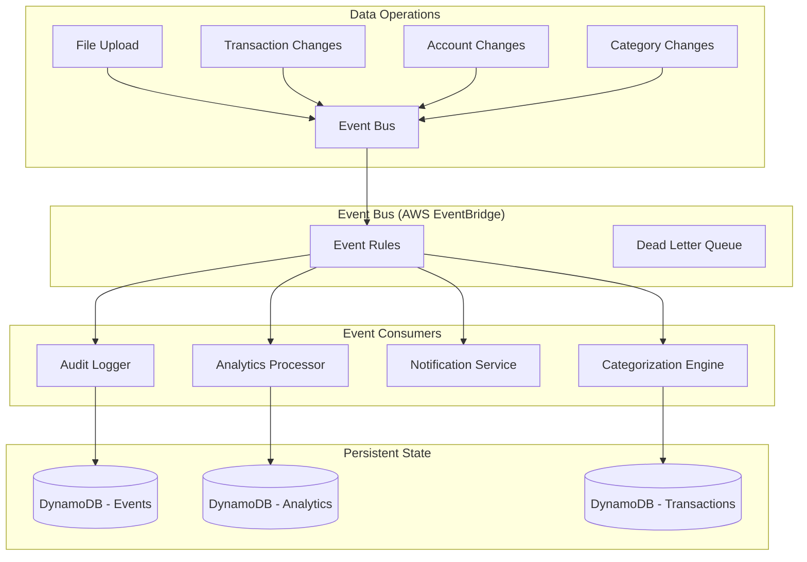

# Event-Driven Architecture Design

## Overview

This document outlines the design for implementing a pub-sub (publish-subscribe) event-driven architecture to handle data state changes in the application. The goal is to decouple operations that need to run when data changes, making the system more maintainable, scalable, and explicit about dependencies between operations.

## Current State Analysis

### Current Triggers and Dependencies

Based on the existing codebase, the following operations currently trigger downstream processes:

1. **Transaction File Upload/Processing**:
   - Triggers: Analytics refresh (medium priority)
   - Current implementation: Direct call to `trigger_analytics_refresh()`

2. **Transaction Changes** (edit, delete, bulk operations):
   - Triggers: Analytics refresh (medium priority)
   - Current implementation: Direct call to `trigger_analytics_for_transaction_change()`

3. **Account Changes** (associate, unassociate, create, update, delete):
   - Triggers: Analytics refresh (priority varies by change type)
   - Current implementation: Direct call to `trigger_analytics_for_account_change()`

4. **Category Rule Application**:
   - Triggers: Transaction categorization, potential analytics refresh
   - Current implementation: Direct categorization via `CategoryRuleEngine`

### Pain Points with Current Approach

1. **Tight Coupling**: Services directly call other services, creating dependencies
2. **Inconsistent Triggering**: Some operations trigger analytics, others don't
3. **Hard to Extend**: Adding new downstream operations requires code changes in multiple places
4. **No Event History**: No record of what events occurred and when
5. **Error Handling**: If downstream operations fail, it can affect the primary operation
6. **Testing Complexity**: Hard to test operations in isolation

## Proposed Event-Driven Architecture

### Architecture Overview



### Core Components

1. **Event Publishers**: Services that publish events when state changes occur
2. **Event Bus**: Central message routing system (AWS EventBridge)
3. **Event Consumers**: Services that subscribe to specific event types
4. **Event Store**: Persistent log of all events for auditing and replay
5. **Dead Letter Queue**: Failed event handling and retry mechanism

## Event Schema Design

### Base Event Structure

```typescript
interface BaseEvent {
  // Event metadata
  eventId: string;           // Unique event identifier
  eventType: string;         // Type of event (see Event Types below)
  eventVersion: string;      // Schema version for backward compatibility
  timestamp: number;         // Unix timestamp in milliseconds
  source: string;           // Which service/component published the event
  
  // Context
  userId: string;           // User who triggered the event
  correlationId?: string;   // For tracking related events
  causationId?: string;     // ID of the event that caused this event
  
  // Event data
  data: Record<string, any>; // Event-specific payload
  metadata?: Record<string, any>; // Additional context
}
```

### Event Types and Schemas

#### 1. File Processing Events

```typescript
// Published when a file is uploaded to S3
interface FileUploadedEvent extends BaseEvent {
  eventType: 'file.uploaded';
  data: {
    fileId: string;
    fileName: string;
    fileSize: number;
    s3Key: string;
    accountId?: string;
    fileFormat?: string;
  };
}

// Published when file processing completes
interface FileProcessedEvent extends BaseEvent {
  eventType: 'file.processed';
  data: {
    fileId: string;
    accountId: string;
    transactionCount: number;
    duplicateCount: number;
    dateRange: {
      startDate: string;
      endDate: string;
    };
    processingStatus: 'success' | 'partial' | 'failed';
    errorMessage?: string;
  };
}

// Published when file is associated with an account
interface FileAssociatedEvent extends BaseEvent {
  eventType: 'file.associated';
  data: {
    fileId: string;
    accountId: string;
    previousAccountId?: string;
  };
}
```

#### 2. Transaction Events

```typescript
// Published when transactions are created from file processing
interface TransactionsCreatedEvent extends BaseEvent {
  eventType: 'transactions.created';
  data: {
    fileId: string;
    accountId: string;
    transactionIds: string[];
    transactionCount: number;
    dateRange: {
      startDate: string;
      endDate: string;
    };
  };
}

// Published when a transaction is manually edited
interface TransactionUpdatedEvent extends BaseEvent {
  eventType: 'transaction.updated';
  data: {
    transactionId: string;
    accountId: string;
    changes: {
      field: string;
      oldValue: any;
      newValue: any;
    }[];
  };
}

// Published when transactions are deleted
interface TransactionsDeletedEvent extends BaseEvent {
  eventType: 'transactions.deleted';
  data: {
    transactionIds: string[];
    accountIds: string[];
    deletionType: 'single' | 'bulk' | 'file_reprocessing';
  };
}

// Published when transaction categorization changes
interface TransactionCategorizedEvent extends BaseEvent {
  eventType: 'transaction.categorized';
  data: {
    transactionId: string;
    accountId: string;
    categoryId: string;
    previousCategoryId?: string;
    confidence: number;
    assignmentType: 'manual' | 'rule_based' | 'suggested';
    ruleId?: string;
  };
}
```

#### 3. Account Events

```typescript
// Published when account is created
interface AccountCreatedEvent extends BaseEvent {
  eventType: 'account.created';
  data: {
    accountId: string;
    accountName: string;
    accountType: string;
    currency: string;
  };
}

// Published when account is updated
interface AccountUpdatedEvent extends BaseEvent {
  eventType: 'account.updated';
  data: {
    accountId: string;
    changes: {
      field: string;
      oldValue: any;
      newValue: any;
    }[];
  };
}

// Published when account is deleted
interface AccountDeletedEvent extends BaseEvent {
  eventType: 'account.deleted';
  data: {
    accountId: string;
    transactionCount: number; // How many transactions were affected
  };
}
```

#### 4. Category Events

```typescript
// Published when category rules are applied to transactions
interface CategoryRulesAppliedEvent extends BaseEvent {
  eventType: 'category.rules_applied';
  data: {
    categoryId: string;
    ruleIds: string[];
    transactionIds: string[];
    applicationType: 'manual' | 'bulk' | 'automated';
  };
}

// Published when a new category rule is created
interface CategoryRuleCreatedEvent extends BaseEvent {
  eventType: 'category.rule_created';
  data: {
    categoryId: string;
    ruleId: string;
    rulePattern: string;
    autoApply: boolean;
  };
}
```

## Event Consumer Design

### 1. Analytics Processor Consumer

Consumes events that should trigger analytics recomputation.

```typescript
interface AnalyticsConsumerConfig {
  eventTypes: [
    'file.processed',
    'transactions.created',
    'transaction.updated',
    'transactions.deleted',
    'account.created',
    'account.updated',
    'account.deleted'
  ];
  priority: {
    'file.processed': 2,        // Medium priority
    'transactions.created': 2,  // Medium priority
    'transaction.updated': 3,   // Low priority (single transaction)
    'transactions.deleted': 2,  // Medium priority
    'account.created': 3,       // Low priority (no transactions yet)
    'account.updated': 3,       // Low priority (metadata only)
    'account.deleted': 1        // High priority (major data change)
  };
}
```

Handler logic:
1. Receive event
2. Determine affected analytics types based on event
3. Create/update `AnalyticsProcessingStatus` records
4. Let existing analytics processor pick up the work

### 2. Categorization Engine Consumer

Applies category rules when new transactions are created.

```typescript
interface CategorizationConsumerConfig {
  eventTypes: [
    'transactions.created',
    'category.rule_created'
  ];
  batchSize: 100; // Process transactions in batches
}
```

Handler logic:
1. Receive `transactions.created` event
2. Get user's active category rules
3. Apply rules to new transactions
4. Publish `transaction.categorized` events for matches

### 3. Notification Service Consumer

Sends notifications for important events.

```typescript
interface NotificationConsumerConfig {
  eventTypes: [
    'file.processed',
    'transactions.deleted',
    'account.deleted'
  ];
}
```

### 4. Audit Logger Consumer

Logs all events for compliance and debugging.

```typescript
interface AuditConsumerConfig {
  eventTypes: ['*']; // Subscribe to all events
  storage: 'dynamodb'; // Store in audit table
}
```

## Implementation Plan

### Phase 1: Event Infrastructure (1-2 weeks)

1. **Create Event Publishing Service**
   ```python
   # backend/src/services/event_service.py
   class EventService:
       def publish_event(self, event: BaseEvent) -> None
       def publish_events_batch(self, events: List[BaseEvent]) -> None
   ```

2. **Set up AWS EventBridge**
   ```terraform
   # infrastructure/terraform/eventbridge.tf
   resource "aws_cloudwatch_event_bus" "app_events"
   resource "aws_cloudwatch_event_rule" "analytics_events"
   resource "aws_cloudwatch_event_rule" "categorization_events"
   ```

3. **Create Event Store**
   ```sql
   -- DynamoDB table for event auditing
   event_store:
     pk: eventId
     sk: timestamp
     eventType, userId, source, data
   ```

### Phase 2: Event Publishers (1-2 weeks)

1. **Modify File Processing**
   ```python
   # In file_processor_service.py
   def process_file(transaction_file: TransactionFile) -> FileProcessorResponse:
       # ... existing logic ...
       
       # Publish events instead of direct calls
       event_service.publish_event(FileProcessedEvent(...))
       
       # Remove direct analytics trigger
       # trigger_analytics_refresh(user_id, priority=2)  # REMOVE
   ```

2. **Modify Transaction Operations**
   ```python
   # In transaction_operations.py
   def update_transaction_handler(...):
       # ... existing logic ...
       event_service.publish_event(TransactionUpdatedEvent(...))
   ```

3. **Modify Account Operations**
   ```python
   # In account_operations.py  
   def associate_file_handler(...):
       # ... existing logic ...
       event_service.publish_event(FileAssociatedEvent(...))
   ```

### Phase 3: Event Consumers (2-3 weeks)

1. **Analytics Consumer Lambda**
   ```python
   # backend/src/consumers/analytics_consumer.py
   def handler(event, context):
       for record in event['Records']:
           event_data = parse_event(record)
           trigger_analytics_for_event(event_data)
   ```

2. **Categorization Consumer Lambda**
   ```python
   # backend/src/consumers/categorization_consumer.py
   def handler(event, context):
       for record in event['Records']:
           event_data = parse_event(record)
           apply_rules_for_new_transactions(event_data)
   ```

3. **Update Existing Analytics Processor**
   - Remove scheduled triggering
   - Keep the computation engine
   - Process events from queue instead of scanning for stale records

### Phase 4: Migration and Testing (1 week)

1. **Gradual Migration**
   - Run both old and new systems in parallel
   - Compare results to ensure consistency
   - Gradually disable old direct triggering

2. **Monitoring and Alerting**
   - Set up CloudWatch dashboards
   - Monitor event throughput and consumer lag
   - Alert on failed events in DLQ

## Configuration and Flexibility

### Event Routing Configuration

```yaml
# config/event_routing.yaml
event_rules:
  analytics_trigger:
    event_patterns:
      - source: ["transaction_service"]
        detail_type: ["file.processed", "transactions.created"]
      - source: ["account_service"] 
        detail_type: ["account.deleted"]
    target: analytics_consumer
    
  categorization_trigger:
    event_patterns:
      - source: ["transaction_service"]
        detail_type: ["transactions.created"]
    target: categorization_consumer
    batch_size: 100
    
  audit_logging:
    event_patterns:
      - source: ["*"]
    target: audit_consumer
```

### Priority and Batching

```python
class EventConsumerConfig:
    """Configuration for event consumers"""
    
    # Event type to priority mapping
    ANALYTICS_PRIORITY_MAP = {
        'file.processed': 2,
        'transactions.created': 2,
        'transaction.updated': 3,
        'account.deleted': 1
    }
    
    # Batching configuration
    CATEGORIZATION_BATCH_SIZE = 100
    ANALYTICS_DEBOUNCE_WINDOW = 300  # 5 minutes
```

## Benefits of This Approach

### 1. Decoupling
- Services don't need to know about downstream dependencies
- Easy to add new consumers without changing publishers
- Can disable/enable consumers independently

### 2. Reliability
- Events are persisted before processing
- Automatic retry with exponential backoff
- Dead letter queues for failed events
- No lost events if consumers are temporarily down

### 3. Scalability
- Consumers can scale independently based on load
- Batch processing for efficiency
- Can add multiple instances of consumers

### 4. Observability
- Complete audit trail of all events
- Easy to debug by following event chain
- Metrics on event processing times and failure rates

### 5. Testability
- Can test publishers and consumers separately
- Easy to replay events for testing
- Can verify expected events are published

### 6. Flexibility
- Easy to change event routing without code changes
- Can add new event types without breaking existing consumers
- Support for event versioning and schema evolution

## Operational Considerations

### 1. Event Ordering
- Events within the same partition key (userId) are processed in order
- Cross-partition ordering not guaranteed (and usually not needed)

### 2. Idempotency
- All event consumers must be idempotent
- Use event IDs to detect and skip duplicate processing
- Store processing state to handle retries

### 3. Error Handling
- Transient errors: Automatic retry with exponential backoff
- Permanent errors: Send to dead letter queue for manual investigation
- Circuit breaker pattern for downstream service failures

### 4. Monitoring
- Track event publishing rates and success/failure
- Monitor consumer lag and processing times
- Alert on dead letter queue buildup

### 5. Cost Optimization
- Use batching to reduce Lambda invocations
- Set appropriate retention periods for event logs
- Consider using SQS for high-volume, simple routing scenarios

## Migration Strategy

### Phase 1: Shadow Mode (Week 1)
- Add event publishing alongside existing direct calls
- Consumers log events but don't take action
- Verify event volume and structure

### Phase 2: Parallel Mode (Week 2)
- Consumers start taking action
- Keep existing direct calls as backup
- Compare results between old and new systems

### Phase 3: Cut-over (Week 3)
- Disable existing direct calls
- Monitor for any issues
- Keep rollback plan ready

### Phase 4: Cleanup (Week 4)
- Remove old triggering code
- Optimize event schemas based on real usage
- Add additional monitoring and alerting

## Conclusion

This event-driven architecture provides a robust, scalable, and maintainable foundation for handling data state changes. It decouples operations, provides clear audit trails, and makes the system much easier to extend and modify over time.

The implementation can be done incrementally, with minimal risk to existing functionality, and provides significant long-term benefits for system maintainability and feature development. 