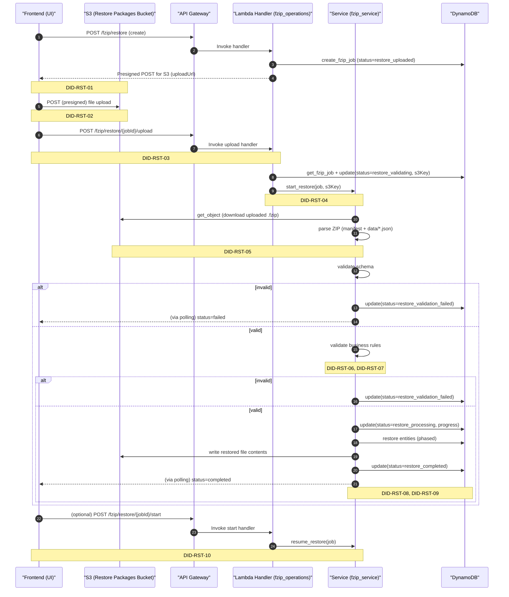
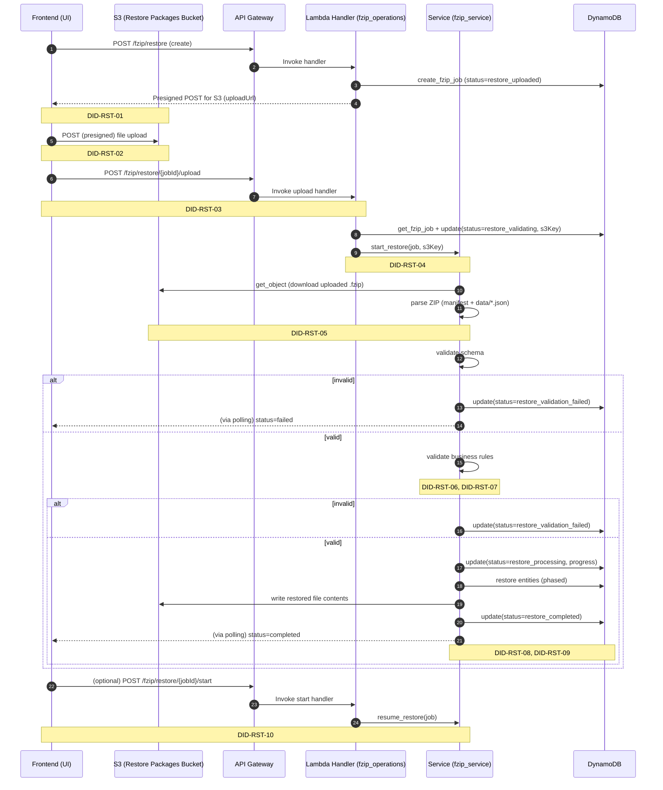
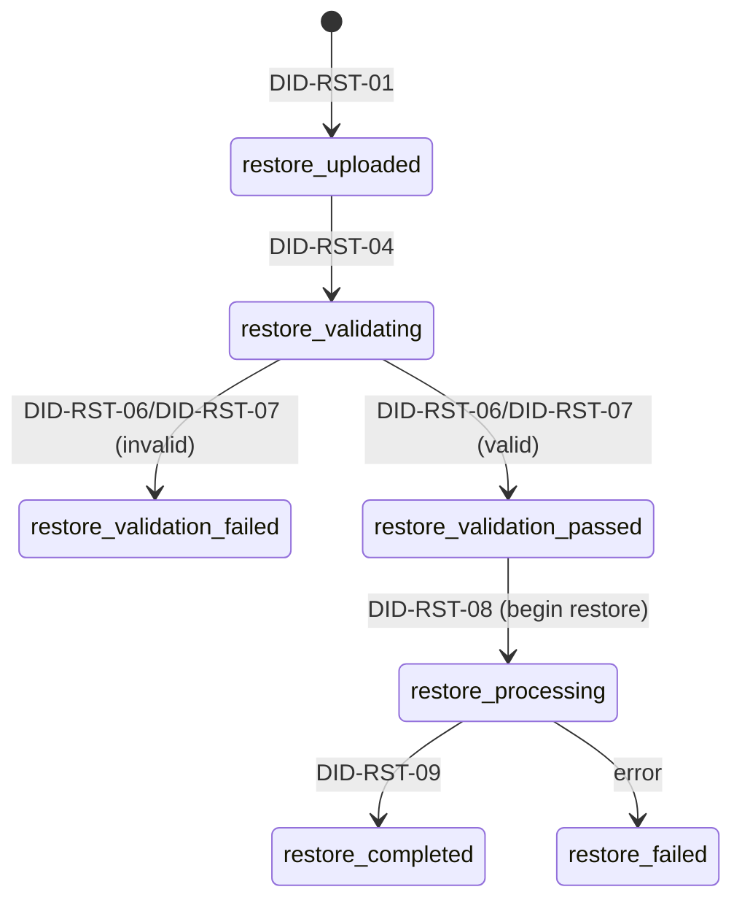

### FZIP Restore Upload Flow

This document explains how a restore package upload is handled end-to-end. Each step has a DID (step id) for easy reference.

#### Step IDs

- DID-RST-01: Create restore job (returns S3 presigned POST)
- DID-RST-02: Browser uploads package to S3 via presigned POST
- DID-RST-03: Frontend notifies backend upload complete
- DID-RST-04: Backend handler transitions job to validating and starts restore
- DID-RST-05: Parse uploaded ZIP from restore bucket
- DID-RST-06: Schema validation
- DID-RST-07: Business rules validation
- DID-RST-08: Restore data in phases (accounts → categories → file maps → transaction files → transactions)
- DID-RST-09: Complete job, emit events
- DID-RST-10: Optional manual resume from validation passed
- DID-RST-11: API Gateway routes and infra wiring

### High-level sequence






### State flow



### Step details

- DID-RST-01: Create restore job, return presigned POST to S3
  - API: POST `/fzip/restore`
  - Handler creates job with `status=restore_uploaded` and returns `uploadUrl`.

```416:446:backend/src/handlers/fzip_operations.py
def create_fzip_restore_handler(event: Dict[str, Any], user_id: str) -> Dict[str, Any]:
    # ...
    upload_url_data = get_presigned_post_url(
        bucket=restore_bucket,
        key=f"packages/{fzip_job.job_id}.fzip",
        expires_in=3600,
        conditions=[{'content-length-range': [1, 1024 * 1024 * 500]}]
    )
    response = FZIPResponse(
        jobId=fzip_job.job_id,
        # ...
        uploadUrl=upload_url_data
    )
```

- DID-RST-02: Browser uploads to S3 using presigned POST
  - Frontend constructs `FormData` with fields then `file`, posts to S3.

```447:474:frontend/src/services/FZIPService.ts
// Create form data and upload to S3 using presigned POST
const formData = new FormData();
Object.entries(uploadUrl.fields).forEach(([k, v]) => formData.append(k, v));
formData.append('file', file);
const uploadResponse = await fetch(uploadUrl.url, { method: 'POST', body: formData });
if (!uploadResponse.ok) throw new Error(`Upload failed: ${uploadResponse.status} ${uploadResponse.statusText}`);
```

- DID-RST-03: Frontend notifies backend that upload is complete
  - API: POST `/fzip/restore/{jobId}/upload` (no body required)

```475:479:frontend/src/services/FZIPService.ts
await authenticatedRequest(`${API_ENDPOINT}/fzip/restore/${restoreId}/upload`, { method: 'POST' });
```

- DID-RST-04: Upload handler transitions job and calls service
  - Validates job exists and is in `restore_uploaded`.
  - Sets `status=restore_validating`, records `s3Key`, calls `start_restore`.

```584:617:backend/src/handlers/fzip_operations.py
def upload_fzip_package_handler(event: Dict[str, Any], user_id: str, job_id: str) -> Dict[str, Any]:
    restore_job = get_fzip_job(job_id, user_id)
    # ... ensure status == RESTORE_UPLOADED ...
    restore_job.status = FZIPStatus.RESTORE_VALIDATING
    restore_job.s3_key = f"packages/{job_id}.fzip"
    fzip_service_instance.start_restore(restore_job, restore_job.s3_key)
```

- DID-RST-05: Service parses uploaded ZIP from restore bucket
  - Downloads `s3Key` from `FZIP_RESTORE_PACKAGES_BUCKET`.

```572:600:backend/src/services/fzip_service.py
def _parse_package(self, package_s3_key: str) -> Dict[str, Any]:
    package_data = get_object_content(package_s3_key, self.restore_packages_bucket)
    with zipfile.ZipFile(io.BytesIO(package_data), 'r') as zipf:
        manifest_data = zipf.read('manifest.json')
        # read data/*.json, return manifest + data + raw
```

- DID-RST-06: Schema validation

```500:507:backend/src/services/fzip_service.py
schema_results = self._validate_schema(package_data)
if not schema_results['valid']:
    restore_job.status = FZIPStatus.RESTORE_VALIDATION_FAILED
    restore_job.error = "Schema validation failed"
    update_fzip_job(restore_job)
    return
```

- DID-RST-07: Business rules validation
  - Ownership, internal consistency; profile emptiness is pre-checked.

```514:524:backend/src/services/fzip_service.py
business_results = self._validate_business_rules(package_data, restore_job.user_id)
if not business_results['valid']:
    restore_job.status = FZIPStatus.RESTORE_VALIDATION_FAILED
    restore_job.error = "Business validation failed"
    update_fzip_job(restore_job)
    return
```

- DID-RST-08: Restore data in phases
  - Phases: accounts → categories → file maps → transaction files (including writing bytes to S3) → transactions.

```736:804:backend/src/services/fzip_service.py
def _restore_data(self, restore_job: FZIPJob, package_data: Dict[str, Any]):
    restore_job.current_phase = "restoring_accounts"; update_fzip_job(restore_job)
    self._restore_accounts(...)
    restore_job.current_phase = "restoring_categories"; update_fzip_job(restore_job)
    self._restore_categories(...)
    restore_job.current_phase = "restoring_file_maps"; update_fzip_job(restore_job)
    self._restore_file_maps(...)
    restore_job.current_phase = "restoring_transaction_files"; update_fzip_job(restore_job)
    self._restore_transaction_files(..., package_data)
    restore_job.current_phase = "restoring_transactions"; update_fzip_job(restore_job)
    self._restore_transactions(...)
```

- DID-RST-09: Complete job and emit events

```796:811:backend/src/services/fzip_service.py
restore_job.status = FZIPStatus.RESTORE_COMPLETED
restore_job.progress = 100
restore_job.current_phase = "completed"
restore_job.restore_results = results
update_fzip_job(restore_job)
event_service.publish_event(RestoreCompletedEvent(...))
```

- DID-RST-10: Optional manual resume after validation passed

```643:675:backend/src/handlers/fzip_operations.py
def start_fzip_restore_handler(...):
    if restore_job.status != FZIPStatus.RESTORE_VALIDATION_PASSED: return 400
    fzip_service_instance.resume_restore(restore_job)
```

- DID-RST-11: API routes and Lambda wiring
  - All restore routes mapped to the versioned `fzip_operations` Lambda via API Gateway.

```702:749:infrastructure/terraform/api_gateway.tf
# FZIP Restore routes
route_key = "POST /fzip/restore"
route_key = "GET /fzip/restore"
route_key = "GET /fzip/restore/{jobId}/status"
route_key = "DELETE /fzip/restore/{jobId}"
route_key = "POST /fzip/restore/{jobId}/upload"
route_key = "POST /fzip/restore/{jobId}/start"
target = integrations/${aws_apigatewayv2_integration.fzip_operations.id}
```

### Buckets and environment

- Restore package is read from `FZIP_RESTORE_PACKAGES_BUCKET` (falls back to `FZIP_PACKAGES_BUCKET`).
  - `FZIPService.restore_packages_bucket`

```63:74:backend/src/services/fzip_service.py
self.fzip_bucket = os.environ.get('FZIP_PACKAGES_BUCKET', 'housef3-dev-fzip-packages')
self.restore_packages_bucket = os.environ.get(
  'FZIP_RESTORE_PACKAGES_BUCKET',
  os.environ.get('FZIP_PACKAGES_BUCKET', 'housef3-dev-fzip-packages')
)
```


