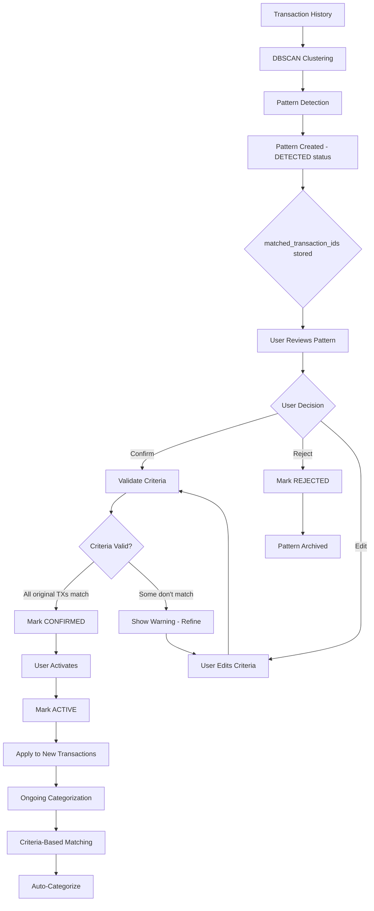

# Recurring Charge Pattern Review & Categorization Workflow

## Overview

A two-phase system for detecting, reviewing, and applying recurring charge patterns:
- **Phase 1**: ML detection with human review and validation
- **Phase 2**: Criteria-based auto-categorization of ongoing transactions

## Architecture



## Data Models

### Pattern Status Lifecycle

```python
class PatternStatus(str, Enum):
    """Lifecycle status of a recurring charge pattern."""
    DETECTED = "detected"      # ML detected, awaiting review
    CONFIRMED = "confirmed"    # User confirmed, criteria validated
    ACTIVE = "active"          # Actively categorizing transactions
    REJECTED = "rejected"      # User rejected pattern
    PAUSED = "paused"          # Temporarily disabled
```

### Enhanced RecurringChargePattern Model

```python
class RecurringChargePattern(BaseModel):
    # ... existing fields ...
    
    # NEW: Store original cluster transactions (Phase 1)
    matched_transaction_ids: Optional[List[uuid.UUID]] = Field(
        default=None,
        alias="matchedTransactionIds",
        description="Transaction IDs used to create this pattern (from DBSCAN cluster)"
    )
    
    # NEW: Pattern lifecycle status
    status: PatternStatus = Field(
        default=PatternStatus.DETECTED,
        description="Current lifecycle status of the pattern"
    )
    
    # EXISTING: Whether pattern should auto-categorize (Phase 2)
    active: bool = Field(
        default=False,  # Changed: patterns start inactive
        description="Whether to apply this pattern for auto-categorization"
    )
    
    # NEW: Validation metadata
    criteria_validated: bool = Field(
        default=False,
        alias="criteriaValidated",
        description="Whether criteria have been validated against original matches"
    )
    
    criteria_validation_errors: Optional[List[str]] = Field(
        default=None,
        alias="criteriaValidationErrors",
        description="Any validation warnings or errors"
    )
    
    # NEW: User review metadata
    reviewed_by: Optional[str] = Field(
        default=None,
        alias="reviewedBy",
        description="User ID who reviewed the pattern"
    )
    
    reviewed_at: Optional[int] = Field(
        default=None,
        alias="reviewedAt",
        description="Timestamp when pattern was reviewed"
    )
```

### Pattern Validation Result

```python
class PatternCriteriaValidation(BaseModel):
    """Result of validating pattern criteria against original matches."""
    
    pattern_id: uuid.UUID = Field(alias="patternId")
    is_valid: bool = Field(alias="isValid")
    
    # Statistics
    original_count: int = Field(alias="originalCount", description="Number of original matched transactions")
    criteria_match_count: int = Field(alias="criteriaMatchCount", description="Number of transactions matching criteria")
    
    # Matching analysis
    all_original_match_criteria: bool = Field(
        alias="allOriginalMatchCriteria",
        description="All original transactions match the pattern criteria"
    )
    
    no_false_positives: bool = Field(
        alias="noFalsePositives", 
        description="Criteria don't match extra transactions beyond original cluster"
    )
    
    perfect_match: bool = Field(
        alias="perfectMatch",
        description="Criteria exactly match original cluster, no more, no less"
    )
    
    # Transaction ID analysis
    missing_from_criteria: List[uuid.UUID] = Field(
        default_factory=list,
        alias="missingFromCriteria",
        description="Original transactions that don't match criteria (false negatives)"
    )
    
    extra_from_criteria: List[uuid.UUID] = Field(
        default_factory=list,
        alias="extraFromCriteria",
        description="Non-original transactions that match criteria (false positives)"
    )
    
    # Recommendations
    warnings: List[str] = Field(default_factory=list)
    suggestions: List[str] = Field(default_factory=list)
```

### User Review Action

```python
class PatternReviewAction(BaseModel):
    """User action when reviewing a pattern."""
    
    pattern_id: uuid.UUID = Field(alias="patternId")
    user_id: str = Field(alias="userId")
    action: str = Field(description="confirm, reject, or edit")
    
    # Optional edits to pattern criteria
    edited_merchant_pattern: Optional[str] = Field(default=None, alias="editedMerchantPattern")
    edited_amount_tolerance_pct: Optional[Decimal] = Field(default=None, alias="editedAmountTolerancePct")
    edited_tolerance_days: Optional[int] = Field(default=None, alias="editedToleranceDays")
    edited_suggested_category_id: Optional[uuid.UUID] = Field(default=None, alias="editedSuggestedCategoryId")
    
    # User notes
    notes: Optional[str] = Field(default=None, description="User's review notes")
    
    # Whether to activate immediately after confirmation
    activate_immediately: bool = Field(default=False, alias="activateImmediately")
```

## Service Layer

### 1. Pattern Detection Service (Existing - Enhanced)

```python
class RecurringChargeDetectionService:
    """Detects patterns and stores matched transaction IDs."""
    
    def detect_recurring_patterns(
        self,
        user_id: str,
        transactions: List[Transaction],
        ...
    ) -> List[RecurringChargePatternCreate]:
        """
        Enhanced to store matched_transaction_ids and set status to DETECTED.
        """
        # ... existing clustering logic ...
        
        for cluster_id in unique_clusters:
            cluster_transactions = [...]
            
            pattern = self._analyze_pattern(
                user_id, 
                cluster_transactions, 
                cluster_id,
                accounts_map
            )
            
            if pattern and pattern.confidence_score >= min_confidence:
                # NEW: Store matched transaction IDs
                pattern.matched_transaction_ids = [
                    tx.transaction_id for tx in cluster_transactions
                ]
                
                # NEW: Set initial status
                pattern.status = PatternStatus.DETECTED
                pattern.active = False  # Don't auto-categorize yet
                
                patterns.append(pattern)
        
        return patterns
```

### 2. Pattern Validation Service (NEW)

```python
class PatternValidationService:
    """Validates pattern criteria against original matched transactions."""
    
    def validate_pattern_criteria(
        self,
        pattern: RecurringChargePattern,
        all_transactions: List[Transaction]
    ) -> PatternCriteriaValidation:
        """
        Validate that pattern criteria correctly match the original cluster.
        
        Args:
            pattern: The pattern to validate
            all_transactions: All user transactions (must include original matches)
            
        Returns:
            Validation result with detailed analysis
        """
        if not pattern.matched_transaction_ids:
            raise ValueError("Pattern has no matched_transaction_ids to validate against")
        
        # Get original cluster transactions
        original_tx_map = {tx.transaction_id: tx for tx in all_transactions}
        original_matches = [
            original_tx_map[tx_id] 
            for tx_id in pattern.matched_transaction_ids 
            if tx_id in original_tx_map
        ]
        
        if len(original_matches) != len(pattern.matched_transaction_ids):
            missing_count = len(pattern.matched_transaction_ids) - len(original_matches)
            logger.warning(
                f"Pattern {pattern.pattern_id}: {missing_count} original transactions not found"
            )
        
        # Apply criteria-based matching to ALL transactions
        criteria_matches = self._match_transactions_by_criteria(pattern, all_transactions)
        
        # Analyze overlap
        original_ids = set(pattern.matched_transaction_ids)
        criteria_ids = set(tx.transaction_id for tx in criteria_matches)
        
        missing_from_criteria = original_ids - criteria_ids
        extra_from_criteria = criteria_ids - original_ids
        
        all_original_match = len(missing_from_criteria) == 0
        no_false_positives = len(extra_from_criteria) == 0
        perfect_match = all_original_match and no_false_positives
        
        # Generate warnings and suggestions
        warnings = []
        suggestions = []
        
        if missing_from_criteria:
            warnings.append(
                f"{len(missing_from_criteria)} original transactions don't match criteria"
            )
            suggestions.append("Consider loosening amount tolerance or date tolerance")
        
        if extra_from_criteria:
            warnings.append(
                f"{len(extra_from_criteria)} additional transactions match criteria"
            )
            suggestions.append("Consider tightening merchant pattern or amount tolerance")
        
        if perfect_match:
            suggestions.append("Criteria perfectly match original cluster - ready to activate")
        
        return PatternCriteriaValidation(
            patternId=pattern.pattern_id,
            isValid=all_original_match,  # Valid if all originals match (extra is OK)
            originalCount=len(original_matches),
            criteriaMatchCount=len(criteria_matches),
            allOriginalMatchCriteria=all_original_match,
            noFalsePositives=no_false_positives,
            perfectMatch=perfect_match,
            missingFromCriteria=list(missing_from_criteria),
            extraFromCriteria=list(extra_from_criteria),
            warnings=warnings,
            suggestions=suggestions
        )
    
    def _match_transactions_by_criteria(
        self,
        pattern: RecurringChargePattern,
        transactions: List[Transaction]
    ) -> List[Transaction]:
        """
        Match transactions using pattern criteria (Phase 2 matching logic).
        
        This is the same logic that will be used for auto-categorization.
        """
        matches = []
        
        for tx in transactions:
            # Only consider transactions in the pattern's time range
            if not (pattern.first_occurrence <= tx.date <= pattern.last_occurrence):
                continue
            
            # Check merchant pattern
            if not self._matches_merchant_pattern(tx.description, pattern.merchant_pattern):
                continue
            
            # Check amount tolerance
            if not self._amount_within_tolerance(tx.amount, pattern):
                continue
            
            # Check temporal pattern (if applicable)
            if not self._matches_temporal_pattern(tx.date, pattern):
                continue
            
            matches.append(tx)
        
        return matches
    
    def _matches_merchant_pattern(self, description: str, pattern: str) -> bool:
        """Check if transaction description matches merchant pattern."""
        # Simple substring match for now
        # Could be enhanced with regex or fuzzy matching
        return pattern.upper() in description.upper()
    
    def _amount_within_tolerance(
        self, 
        amount: Decimal, 
        pattern: RecurringChargePattern
    ) -> bool:
        """Check if amount is within pattern tolerance."""
        abs_amount = abs(amount)
        tolerance = pattern.amount_mean * (pattern.amount_tolerance_pct / Decimal("100"))
        min_amount = pattern.amount_mean - tolerance
        max_amount = pattern.amount_mean + tolerance
        return min_amount <= abs_amount <= max_amount
    
    def _matches_temporal_pattern(
        self, 
        tx_date: int, 
        pattern: RecurringChargePattern
    ) -> bool:
        """Check if transaction date matches temporal pattern."""
        from datetime import datetime, timezone
        
        dt = datetime.fromtimestamp(tx_date / 1000, tz=timezone.utc)
        
        # Check day of week if specified
        if pattern.day_of_week is not None:
            if dt.weekday() != pattern.day_of_week:
                return False
        
        # Check day of month if specified
        if pattern.day_of_month is not None:
            day_diff = abs(dt.day - pattern.day_of_month)
            if day_diff > pattern.tolerance_days:
                return False
        
        return True
```

### 3. Pattern Review Service (NEW)

```python
class PatternReviewService:
    """Handles user review actions on detected patterns."""
    
    def __init__(self, validation_service: PatternValidationService):
        self.validation_service = validation_service
    
    def review_pattern(
        self,
        pattern: RecurringChargePattern,
        review_action: PatternReviewAction,
        all_transactions: List[Transaction]
    ) -> tuple[RecurringChargePattern, Optional[PatternCriteriaValidation]]:
        """
        Process user review of a pattern.
        
        Returns:
            Updated pattern and validation result (if applicable)
        """
        if pattern.status not in [PatternStatus.DETECTED, PatternStatus.CONFIRMED]:
            raise ValueError(f"Pattern status {pattern.status} cannot be reviewed")
        
        # Record review metadata
        pattern.reviewed_by = review_action.user_id
        pattern.reviewed_at = int(datetime.now(timezone.utc).timestamp() * 1000)
        
        validation_result = None
        
        if review_action.action == "reject":
            pattern.status = PatternStatus.REJECTED
            pattern.active = False
            logger.info(f"Pattern {pattern.pattern_id} rejected by user {review_action.user_id}")
        
        elif review_action.action == "edit":
            # Apply user edits
            if review_action.edited_merchant_pattern is not None:
                pattern.merchant_pattern = review_action.edited_merchant_pattern
            if review_action.edited_amount_tolerance_pct is not None:
                pattern.amount_tolerance_pct = review_action.edited_amount_tolerance_pct
            if review_action.edited_tolerance_days is not None:
                pattern.tolerance_days = review_action.edited_tolerance_days
            if review_action.edited_suggested_category_id is not None:
                pattern.suggested_category_id = review_action.edited_suggested_category_id
            
            # Re-validate with new criteria
            validation_result = self.validation_service.validate_pattern_criteria(
                pattern, all_transactions
            )
            
            pattern.criteria_validated = validation_result.is_valid
            pattern.criteria_validation_errors = validation_result.warnings
            
            # Update status based on validation
            if validation_result.is_valid:
                pattern.status = PatternStatus.CONFIRMED
                if review_action.activate_immediately:
                    pattern.status = PatternStatus.ACTIVE
                    pattern.active = True
            
            logger.info(
                f"Pattern {pattern.pattern_id} edited and validated "
                f"(valid={validation_result.is_valid})"
            )
        
        elif review_action.action == "confirm":
            # Validate criteria match original cluster
            validation_result = self.validation_service.validate_pattern_criteria(
                pattern, all_transactions
            )
            
            pattern.criteria_validated = validation_result.is_valid
            pattern.criteria_validation_errors = validation_result.warnings
            
            # Update status
            pattern.status = PatternStatus.CONFIRMED
            
            if review_action.activate_immediately and validation_result.is_valid:
                pattern.status = PatternStatus.ACTIVE
                pattern.active = True
            
            logger.info(
                f"Pattern {pattern.pattern_id} confirmed "
                f"(valid={validation_result.is_valid}, "
                f"active={pattern.active})"
            )
        
        else:
            raise ValueError(f"Invalid review action: {review_action.action}")
        
        pattern.updated_at = int(datetime.now(timezone.utc).timestamp() * 1000)
        
        return pattern, validation_result
    
    def activate_pattern(self, pattern: RecurringChargePattern) -> RecurringChargePattern:
        """Activate a confirmed pattern for auto-categorization."""
        if pattern.status != PatternStatus.CONFIRMED:
            raise ValueError(
                f"Only CONFIRMED patterns can be activated (current: {pattern.status})"
            )
        
        if not pattern.criteria_validated:
            raise ValueError("Pattern criteria must be validated before activation")
        
        pattern.status = PatternStatus.ACTIVE
        pattern.active = True
        pattern.updated_at = int(datetime.now(timezone.utc).timestamp() * 1000)
        
        logger.info(f"Pattern {pattern.pattern_id} activated for auto-categorization")
        
        return pattern
    
    def pause_pattern(self, pattern: RecurringChargePattern) -> RecurringChargePattern:
        """Temporarily pause an active pattern."""
        if pattern.status != PatternStatus.ACTIVE:
            raise ValueError(f"Only ACTIVE patterns can be paused (current: {pattern.status})")
        
        pattern.status = PatternStatus.PAUSED
        pattern.active = False
        pattern.updated_at = int(datetime.now(timezone.utc).timestamp() * 1000)
        
        logger.info(f"Pattern {pattern.pattern_id} paused")
        
        return pattern
```

### 4. Pattern Matching Service (NEW - Phase 2)

```python
class PatternMatchingService:
    """Matches transactions against active patterns for auto-categorization."""
    
    def __init__(self, validation_service: PatternValidationService):
        self.validation_service = validation_service
    
    def find_matching_patterns(
        self,
        transaction: Transaction,
        active_patterns: List[RecurringChargePattern]
    ) -> List[tuple[RecurringChargePattern, Decimal]]:
        """
        Find all active patterns that match a transaction.
        
        Returns:
            List of (pattern, confidence_score) tuples, sorted by confidence descending
        """
        matches = []
        
        for pattern in active_patterns:
            if pattern.status != PatternStatus.ACTIVE or not pattern.active:
                continue
            
            # Use the same criteria-based matching as validation
            if self._transaction_matches_pattern(transaction, pattern):
                # Confidence is the pattern's base confidence score
                # Could be adjusted based on how well the transaction fits
                matches.append((pattern, pattern.confidence_score))
        
        # Sort by confidence descending
        matches.sort(key=lambda x: x[1], reverse=True)
        
        return matches
    
    def _transaction_matches_pattern(
        self,
        transaction: Transaction,
        pattern: RecurringChargePattern
    ) -> bool:
        """Check if a single transaction matches pattern criteria."""
        # Reuse validation service's matching logic
        matches = self.validation_service._match_transactions_by_criteria(
            pattern, [transaction]
        )
        return len(matches) > 0
    
    def get_matching_transactions(
        self,
        pattern: RecurringChargePattern,
        transactions: List[Transaction]
    ) -> List[Transaction]:
        """
        Get all transactions that match a pattern's criteria.
        
        This is the Phase 2 matching - can be used for:
        - Retroactive categorization
        - Showing current matches in UI
        - Pattern effectiveness analysis
        """
        return self.validation_service._match_transactions_by_criteria(
            pattern, transactions
        )
```

## API Endpoints

### Pattern Review Endpoints

```python
# GET /recurring-patterns?status=detected&userId={userId}
# List patterns awaiting review
def list_patterns_for_review(user_id: str, status: Optional[str] = None):
    """Get patterns for user review."""
    pass

# GET /recurring-patterns/{patternId}
# Get pattern details with matched transactions
def get_pattern_with_matches(pattern_id: uuid.UUID):
    """
    Get pattern with original matched transaction details.
    Returns pattern + list of matched transactions for review.
    """
    pass

# POST /recurring-patterns/{patternId}/validate
# Validate pattern criteria
def validate_pattern(pattern_id: uuid.UUID):
    """
    Validate pattern criteria against original matches.
    Returns validation result.
    """
    pass

# POST /recurring-patterns/{patternId}/review
# Review pattern (confirm/reject/edit)
def review_pattern(pattern_id: uuid.UUID, action: PatternReviewAction):
    """
    User reviews and acts on a pattern.
    Body: PatternReviewAction
    Returns: Updated pattern + validation result
    """
    pass

# POST /recurring-patterns/{patternId}/activate
# Activate confirmed pattern
def activate_pattern(pattern_id: uuid.UUID):
    """Activate a confirmed pattern for auto-categorization."""
    pass

# POST /recurring-patterns/{patternId}/pause
# Pause active pattern
def pause_pattern(pattern_id: uuid.UUID):
    """Temporarily pause an active pattern."""
    pass

# GET /recurring-patterns/{patternId}/matching-transactions
# Get transactions matching pattern criteria
def get_matching_transactions(pattern_id: uuid.UUID):
    """
    Get all transactions that currently match pattern criteria.
    Used for Phase 2 visualization and verification.
    """
    pass
```

### Auto-Categorization Endpoint

```python
# POST /transactions/{transactionId}/auto-categorize
# Apply active patterns to categorize transaction
def auto_categorize_transaction(transaction_id: uuid.UUID):
    """
    Find matching active patterns and suggest/apply category.
    Returns list of matching patterns with confidence scores.
    """
    pass

# POST /transactions/batch-categorize
# Apply patterns to multiple transactions
def batch_categorize_transactions(transaction_ids: List[uuid.UUID]):
    """
    Batch categorization for retroactive application.
    """
    pass
```

## UI Workflow

### 1. Pattern Review Screen

```
┌─────────────────────────────────────────────────────────────┐
│ Recurring Charge Pattern Review                             │
├─────────────────────────────────────────────────────────────┤
│                                                              │
│ Pattern: NETFLIX Monthly Subscription                       │
│ Confidence: 94%                                              │
│ Status: 🟡 Awaiting Review                                   │
│                                                              │
│ ┌─────────────────────────────────────────────────────────┐ │
│ │ Pattern Criteria                                        │ │
│ │                                                         │ │
│ │ Merchant:   NETFLIX                    [Edit]          │ │
│ │ Frequency:  Monthly                                    │ │
│ │ Amount:     $14.99 ± 10%                [Edit]         │ │
│ │ Date:       15th of month ± 2 days      [Edit]         │ │
│ │ Category:   Entertainment > Streaming   [Edit]         │ │
│ └─────────────────────────────────────────────────────────┘ │
│                                                              │
│ ┌─────────────────────────────────────────────────────────┐ │
│ │ Matched Transactions (12)                               │ │
│ │                                                         │ │
│ │ ✓ 2024-01-15  NETFLIX.COM         $14.99              │ │
│ │ ✓ 2024-02-15  NETFLIX.COM         $14.99              │ │
│ │ ✓ 2024-03-15  NETFLIX.COM         $14.99              │ │
│ │ ✓ 2024-04-15  NETFLIX.COM         $14.99              │ │
│ │ ✓ 2024-05-15  NETFLIX.COM         $14.99              │ │
│ │ ✓ 2024-06-15  NETFLIX.COM         $14.99              │ │
│ │ ... 6 more                                              │ │
│ │                                                         │ │
│ │ [View All Transactions]                                 │ │
│ └─────────────────────────────────────────────────────────┘ │
│                                                              │
│ [Validate Criteria]  ← Shows how many TXs match criteria    │
│                                                              │
│ Actions:                                                     │
│ [✓ Confirm & Activate]  [✓ Confirm]  [✗ Reject]           │
│                                                              │
└─────────────────────────────────────────────────────────────┘
```

### 2. Criteria Validation Result

```
┌─────────────────────────────────────────────────────────────┐
│ Criteria Validation Result                                   │
├─────────────────────────────────────────────────────────────┤
│                                                              │
│ Status: ✓ Valid                                              │
│                                                              │
│ Original Matches:  12 transactions                           │
│ Criteria Matches:  12 transactions                           │
│                                                              │
│ ✓ All original transactions match criteria                  │
│ ✓ No false positives detected                               │
│ ✓ Perfect match                                              │
│                                                              │
│ 💡 Criteria perfectly match original cluster                │
│    Ready to activate for auto-categorization                │
│                                                              │
│ [Activate Pattern]  [Review Later]                          │
│                                                              │
└─────────────────────────────────────────────────────────────┘
```

### 3. Validation Warning Example

```
┌─────────────────────────────────────────────────────────────┐
│ Criteria Validation Result                                   │
├─────────────────────────────────────────────────────────────┤
│                                                              │
│ Status: ⚠️ Needs Refinement                                  │
│                                                              │
│ Original Matches:  12 transactions                           │
│ Criteria Matches:  15 transactions                           │
│                                                              │
│ ✓ All original transactions match criteria                  │
│ ⚠️ 3 additional transactions also match                      │
│                                                              │
│ Extra Matches:                                               │
│ • 2024-07-15  NETFLIX GIFT CARD    $50.00                  │
│ • 2024-08-20  NETFLIX DVD RENTAL   $3.99                   │
│ • 2024-09-10  NETFLIX              $19.99                  │
│                                                              │
│ 💡 Suggestions:                                              │
│    • Tighten amount tolerance to exclude outliers           │
│    • Refine merchant pattern to exclude "GIFT CARD"         │
│                                                              │
│ [Refine Criteria]  [Accept As-Is]  [Cancel]                │
│                                                              │
└─────────────────────────────────────────────────────────────┘
```

### 4. Active Patterns Dashboard

```
┌─────────────────────────────────────────────────────────────┐
│ Active Recurring Patterns                                    │
├─────────────────────────────────────────────────────────────┤
│                                                              │
│ ┌─────────────────────────────────────────────────────────┐ │
│ │ 🟢 NETFLIX Monthly - $14.99                             │ │
│ │    12 transactions matched • Last: 2024-11-15           │ │
│ │    Category: Entertainment > Streaming                  │ │
│ │    [View Matches] [Edit] [Pause]                        │ │
│ └─────────────────────────────────────────────────────────┘ │
│                                                              │
│ ┌─────────────────────────────────────────────────────────┐ │
│ │ 🟢 SPOTIFY Premium - $9.99                              │ │
│ │    24 transactions matched • Last: 2024-11-01           │ │
│ │    Category: Entertainment > Music                      │ │
│ │    [View Matches] [Edit] [Pause]                        │ │
│ └─────────────────────────────────────────────────────────┘ │
│                                                              │
│ ┌─────────────────────────────────────────────────────────┐ │
│ │ 🟢 Gym Membership - $50.00                              │ │
│ │    18 transactions matched • Last: 2024-11-01           │ │
│ │    Category: Health & Fitness                           │ │
│ │    [View Matches] [Edit] [Pause]                        │ │
│ └─────────────────────────────────────────────────────────┘ │
│                                                              │
└─────────────────────────────────────────────────────────────┘
```

## Database Schema Updates

### RecurringChargePatterns Table (DynamoDB)

```
Existing Fields:
- patternId (UUID) - PK
- userId (String) - GSI PK
- merchantPattern (String)
- frequency (String)
- temporalPatternType (String)
- dayOfWeek (Number, optional)
- dayOfMonth (Number, optional)
- toleranceDays (Number)
- amountMean (Number/Decimal)
- amountStd (Number/Decimal)
- amountMin (Number/Decimal)
- amountMax (Number/Decimal)
- amountTolerancePct (Number/Decimal)
- confidenceScore (Number/Decimal)
- transactionCount (Number)
- firstOccurrence (Number - timestamp)
- lastOccurrence (Number - timestamp)
- featureVector (List of Numbers, optional)
- clusterId (Number, optional)
- suggestedCategoryId (UUID, optional)
- autoCategorize (Boolean) -> stored as String for GSI
- active (Boolean) -> stored as String for GSI
- createdAt (Number - timestamp)
- updatedAt (Number - timestamp)

NEW Fields:
- matchedTransactionIds (List of Strings) - Transaction IDs from cluster
- status (String) - detected|confirmed|active|rejected|paused
- criteriaValidated (Boolean) -> stored as String
- criteriaValidationErrors (List of Strings, optional)
- reviewedBy (String, optional) - User ID
- reviewedAt (Number - timestamp, optional)
```

### New GSI: UserIdStatusIndex

```
Partition Key: userId
Sort Key: status
Projection: ALL

Purpose: Query patterns by user and status
Example: Get all DETECTED patterns for user review
```

## Implementation Phases

### Phase 1: Foundation (Week 1-2)
- [ ] Update `RecurringChargePattern` model with new fields
- [ ] Add `PatternStatus` enum
- [ ] Add `PatternCriteriaValidation` model
- [ ] Add `PatternReviewAction` model
- [ ] Update Terraform for DynamoDB schema changes
- [ ] Add UserIdStatusIndex GSI
- [ ] Write comprehensive unit tests

### Phase 2: Services (Week 3-4)
- [ ] Enhance `RecurringChargeDetectionService` to store matched transaction IDs
- [ ] Implement `PatternValidationService`
- [ ] Implement `PatternReviewService`
- [ ] Implement `PatternMatchingService`
- [ ] Write integration tests for services
- [ ] Performance testing with large transaction sets

### Phase 3: API (Week 5)
- [ ] Implement pattern review endpoints
- [ ] Implement validation endpoints
- [ ] Implement pattern activation/pause endpoints
- [ ] Implement matching transaction retrieval
- [ ] API documentation
- [ ] API integration tests

### Phase 4: Auto-Categorization (Week 6)
- [ ] Implement auto-categorization logic
- [ ] Implement batch categorization
- [ ] Add pattern matching to transaction ingestion pipeline
- [ ] Add pattern effectiveness tracking
- [ ] Performance optimization

### Phase 5: Frontend (Week 7-8)
- [ ] Pattern review UI
- [ ] Validation result display
- [ ] Active patterns dashboard
- [ ] Pattern editing interface
- [ ] Transaction matching visualization
- [ ] User testing and refinement

### Phase 6: Analytics & Refinement (Week 9)
- [ ] Pattern effectiveness metrics
- [ ] Auto-categorization accuracy tracking
- [ ] User review analytics
- [ ] Pattern suggestion improvements
- [ ] Documentation and training materials

## Success Metrics

### Pattern Quality
- **Validation Rate**: % of patterns with `perfect_match` validation
- **Review Rate**: % of DETECTED patterns reviewed within 7 days
- **Activation Rate**: % of CONFIRMED patterns activated
- **Rejection Rate**: % of DETECTED patterns rejected

### Auto-Categorization Performance
- **Coverage**: % of transactions auto-categorized
- **Accuracy**: % of auto-categorizations accepted by users
- **Pattern Effectiveness**: Average transactions matched per active pattern
- **User Satisfaction**: User feedback on categorization quality

### System Performance
- **Detection Speed**: Time to detect patterns (target: <2s for 1000 transactions)
- **Validation Speed**: Time to validate criteria (target: <500ms)
- **Matching Speed**: Time to match transaction (target: <100ms)

## Edge Cases & Considerations

### 1. Pattern Evolution
- What if a recurring charge amount changes (e.g., Netflix price increase)?
- **Solution**: Allow pattern updates and re-validation

### 2. Duplicate Patterns
- What if multiple patterns match the same transaction?
- **Solution**: Return all matches sorted by confidence, let user choose

### 3. Pattern Gaps
- What if a recurring charge is missed (e.g., account on hold)?
- **Solution**: Track expected vs. actual occurrences, alert user

### 4. False Negatives
- What if criteria are too strict and miss valid transactions?
- **Solution**: Validation warnings guide user to loosen criteria

### 5. False Positives
- What if criteria are too loose and match wrong transactions?
- **Solution**: Validation warnings guide user to tighten criteria

### 6. Historical Categorization
- Should activating a pattern retroactively categorize old transactions?
- **Solution**: Provide batch categorization option with user confirmation

### 7. Pattern Conflicts
- Multiple active patterns for same merchant but different amounts?
- **Solution**: Allow multiple patterns, match by best fit (confidence + specificity)

### 8. Data Privacy
- Storing transaction IDs in patterns - privacy implications?
- **Solution**: Transaction IDs are UUIDs (not PII), same privacy as transactions table

## Future Enhancements

### Machine Learning Improvements
1. **Adaptive Tolerance**: ML learns optimal tolerance values from user feedback
2. **Smart Criteria Suggestion**: Suggest criteria refinements based on validation results
3. **Anomaly Detection**: Flag when a recurring charge deviates from pattern
4. **Prediction Accuracy**: Track prediction vs. actual and improve models

### User Experience
1. **Smart Notifications**: Alert when new pattern detected
2. **One-Click Approval**: Quick approve high-confidence patterns
3. **Bulk Review**: Review multiple similar patterns at once
4. **Pattern Templates**: User-created templates for common subscriptions

### Advanced Features
1. **Pattern Merging**: Merge similar patterns (e.g., same merchant, different accounts)
2. **Pattern Splitting**: Split pattern if criteria too broad
3. **Scheduled Reviews**: Periodic re-validation of active patterns
4. **Pattern Sharing**: Share pattern templates across users (opt-in)

## References

- [DBSCAN Clustering Documentation](https://scikit-learn.org/stable/modules/generated/sklearn.cluster.DBSCAN.html)
- [DynamoDB Best Practices](https://docs.aws.amazon.com/amazondynamodb/latest/developerguide/best-practices.html)
- Backend conventions: `.cursor/rules/backend-conventions.mdc`
- Model conventions: `.cursor/rules/backend-models-conventions.mdc`


